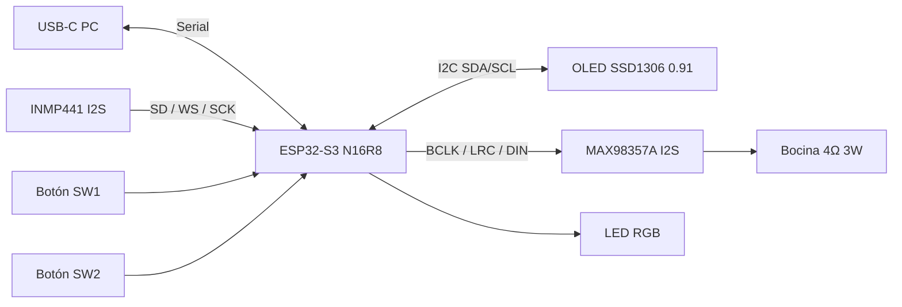
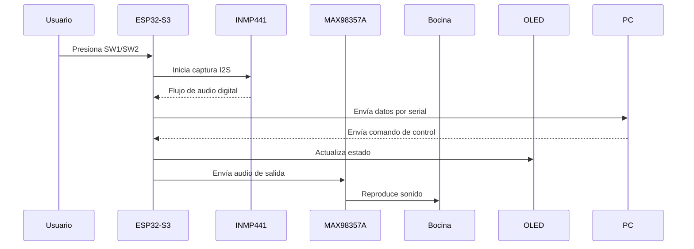

# Arquitectura del kit

## Diagrama general

## Componentes

- ESP32-S3 N16R8 (placa principal)
- OLED SSD1306 0.91" por I2C
- Micrófono INMP441 por I2S
- Amplificador MAX98357A por I2S
- Bocina pasiva 4Ω 3W
- Botones SW1 y SW2
- LED RGB integrado
- USB-C para alimentación y comunicación serial

## Flujo funcional

