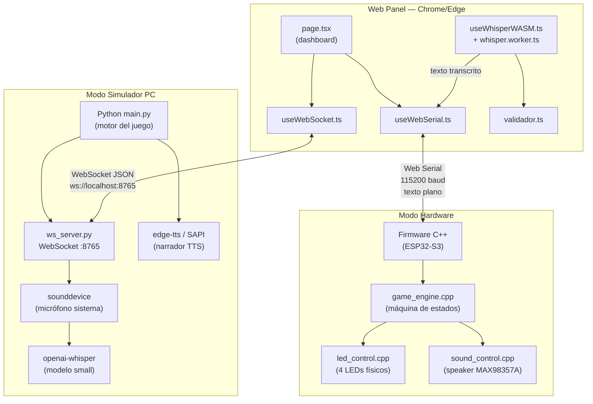
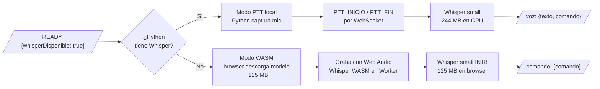
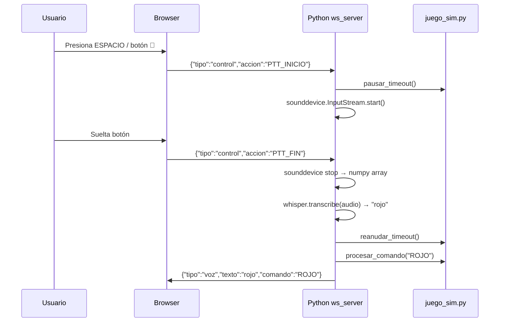
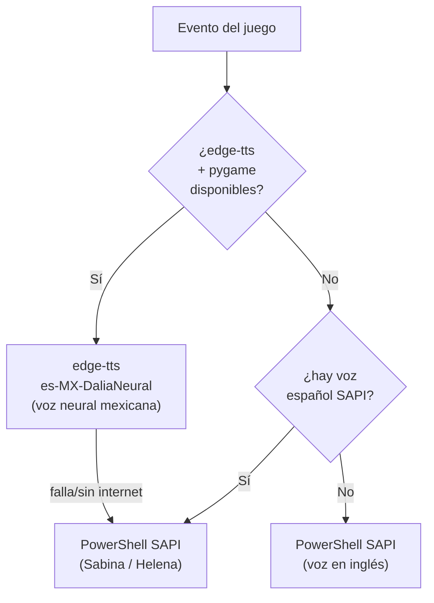
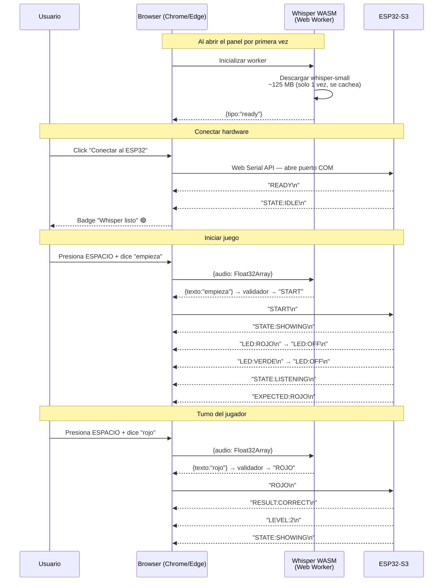
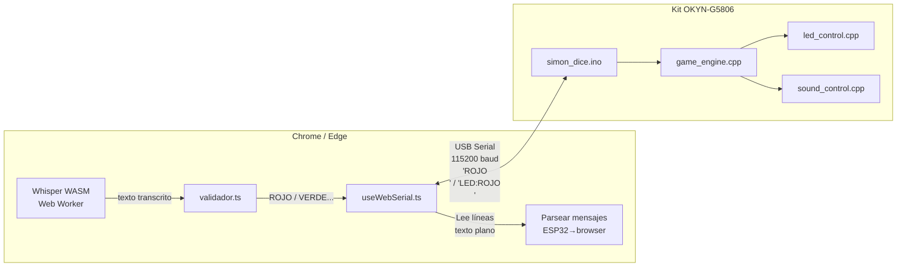
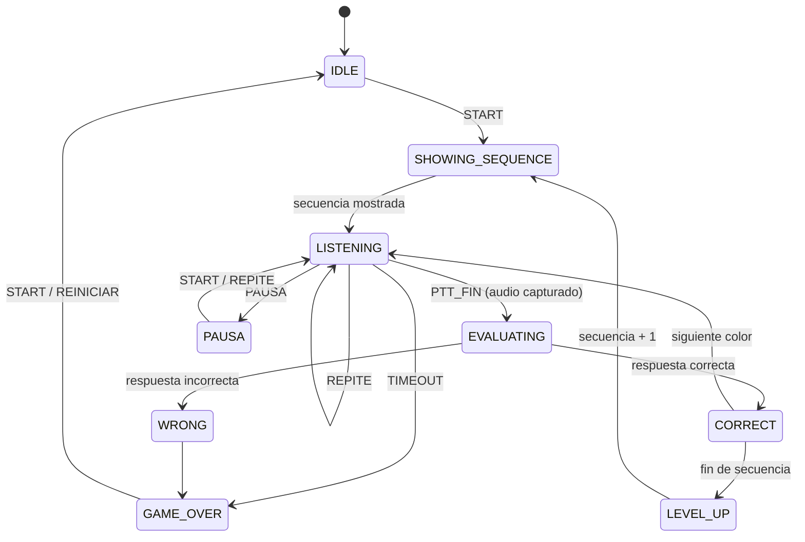

# Arquitectura — Simon Dice por Voz

## Visión general

El sistema tiene dos modos de operación, ambos usan el mismo Web Panel en Next.js:

| Modo | Cuándo usarlo | Requiere |
|---|---|---|
| **Simulador PC** | Pruebas sin hardware | Python + Chrome/Edge |
| **Modo ESP32** | Con kit ESP32 real (producción) | Kit + cable USB + Chrome/Edge |

---

## Diagrama general del sistema



---

## Modo Simulador PC

El simulador replica el comportamiento del ESP32 en la PC: corre el motor del juego,
simula los LEDs en la terminal y reproduce tonos y TTS por el speaker del sistema.

### Reconocimiento de voz — modo DUAL



**Preferido — Whisper local en Python:**
- Python captura el micrófono del sistema directamente con `sounddevice`
- El browser **NO** necesita permisos de micrófono
- Browser envía `PTT_INICIO` / `PTT_FIN` al presionar/soltar el botón o barra espaciadora
- Python graba, transcribe con `openai-whisper` (modelo `small`) y devuelve texto+comando

**Fallback — Whisper WASM en browser:**
- Solo se activa si Python no tiene Whisper instalado
- El browser descarga el modelo (`onnx-community/whisper-small`, ~125 MB, se cachea)
- El browser captura el micrófono con Web Audio API (modo PTT)

### Flujo PTT completo (Whisper local)



### Narrador TTS



**Eventos narrados:**
- Conexión: bienvenida + instrucciones ("presiona el botón y di empieza")
- SHOWING: "Mira y escucha." + nombre de cada color al mostrarlo
- LISTENING: "Tu turno. Presiona el botón para hablar."
- CORRECT: "Correcto."
- LEVEL_UP: "Nivel N."
- WRONG: "Incorrecto. Di empieza para intentar de nuevo."
- TIMEOUT: "Tiempo agotado. Di empieza para intentar de nuevo."
- GAME_OVER: "Fin del juego. Obtuviste N puntos. Di empieza para volver a jugar."

---

## Modo ESP32 — Producción

El modo definitivo. Solo requiere: kit ESP32 + cable USB + Chrome o Edge.
**No se necesita instalar Python.**

### Cómo funciona — paso a paso



### Diagrama de comunicación Serial



### Mensajes del protocolo Serial

**ESP32 → browser:**
```
READY               sistema inicializado
STATE:IDLE          esperando inicio
STATE:SHOWING       mostrando secuencia de LEDs
STATE:LISTENING     esperando respuesta del jugador
STATE:EVALUATING    procesando respuesta
STATE:GAMEOVER      fin del juego
STATE:PAUSA         juego pausado
LED:ROJO            LED rojo encendido
LED:OFF             LEDs apagados
RESULT:CORRECT      respuesta correcta
RESULT:WRONG        respuesta incorrecta
RESULT:TIMEOUT      no habló a tiempo
SEQUENCE:ROJO,AZUL  secuencia completa del nivel
EXPECTED:VERDE      color esperado en este turno
LEVEL:3             nivel actual
SCORE:30            puntuación actual
```

**browser → ESP32:**
```
ROJO\n              comando reconocido por Whisper
DESCONOCIDO\n       no se entendió
```

---

## Máquina de estados del juego



---

## IA — Whisper

| | Whisper local (Python) | Whisper WASM (browser) |
|---|---|---|
| Librería | `openai-whisper` | `@huggingface/transformers` v3 |
| Modelo | `small` (244 MB) | `small` cuantizado INT8 (125 MB) |
| Micrófono | Python `sounddevice` | Web Audio API |
| Permisos mic browser | No necesita | Sí |
| Latencia (CPU) | 2–8 s | 1–3 s |
| Caché | carpeta `~/.cache/whisper` | IndexedDB del browser |
| Disponible en | Solo simulador PC | Simulador (fallback) + ESP32 |

---

## Estructura de carpetas

```
sistemas-inteligentes/
│
├── firmware/              C++ Arduino — corre en el ESP32-S3
│   ├── simon_dice.ino     entry point, setup() y loop()
│   ├── vocabulario.h      ÚNICA fuente del vocabulario de comandos
│   ├── game_engine.h/cpp  máquina de estados (TIMEOUT_RESPUESTA=30000ms)
│   ├── led_control.h/cpp  control de los 4 LEDs físicos
│   ├── sound_control.h/cpp tonos por speaker MAX98357A
│   ├── audio_capture.h/cpp captura I2S (reservado)
│   └── serial_comm.h/cpp  protocolo de texto por USB Serial
│
├── tests/
│   └── simulador_pc/
│       ├── main.py        entry point: juego + WebSocket + hilos
│       ├── juego_sim.py   lógica del juego (espejo de game_engine.cpp)
│       ├── audio_pc.py    sounddevice (tonos + mic PTT) + edge-tts/SAPI
│       ├── leds_sim.py    LEDs simulados en terminal (ANSI)
│       ├── ws_server.py   WebSocket ↔ panel; READY con info dispositivos
│       ├── validador.py   normaliza texto → comando
│       ├── config_test.py WHISPER_MODEL, TIMEOUT_RESPUESTA, SAMPLE_RATE
│       └── requirements_test.txt
│
├── web-panel/             Next.js 14 + TypeScript
│   ├── app/
│   │   ├── page.tsx       dashboard principal
│   │   └── components/    GameStatus, LEDPanel, SequenceDisplay,
│   │                      LogConsole, ScoreBoard, ConnectionPanel, HowToPlay
│   ├── hooks/
│   │   ├── useWebSocket.ts    modo simulador
│   │   ├── useWebSerial.ts    modo ESP32
│   │   └── useWhisperWASM.ts  Whisper WASM (lazy load)
│   ├── workers/
│   │   └── whisper.worker.ts  Web Worker con @huggingface/transformers
│   ├── lib/
│   │   └── validador.ts       texto → comando
│   └── types/game.ts
│
└── docs/
    ├── arquitectura.md    (este archivo)
    └── setup.md
```

---

## Modos del panel

| Modo | Toggle | Cuándo usar |
|---|---|---|
| **Simulador — WebSocket** | "WebSocket" | `python main.py` corriendo en PC |
| **ESP32 — Web Serial** | "Serial" | Kit ESP32 conectado por USB |
