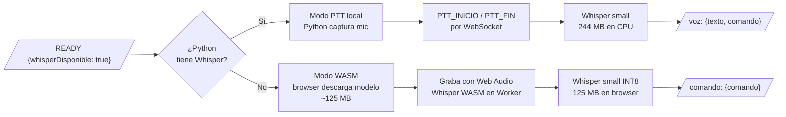
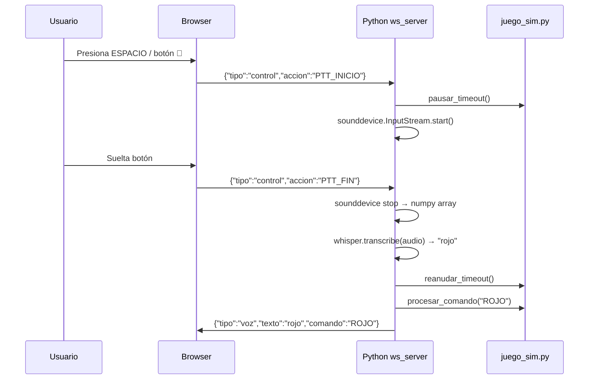
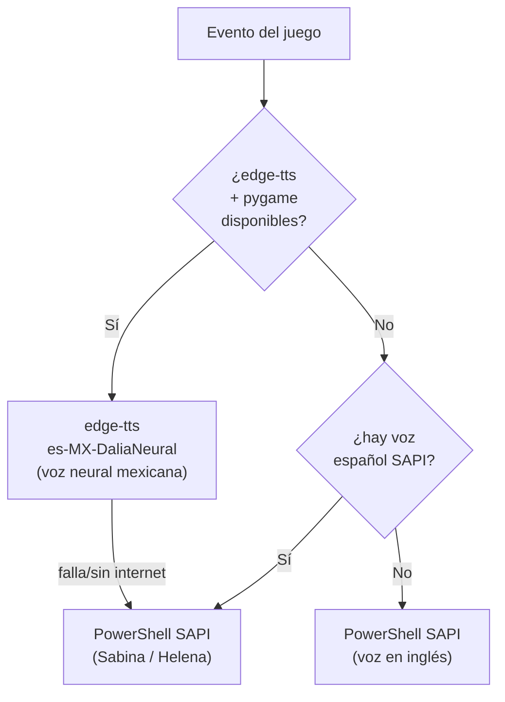
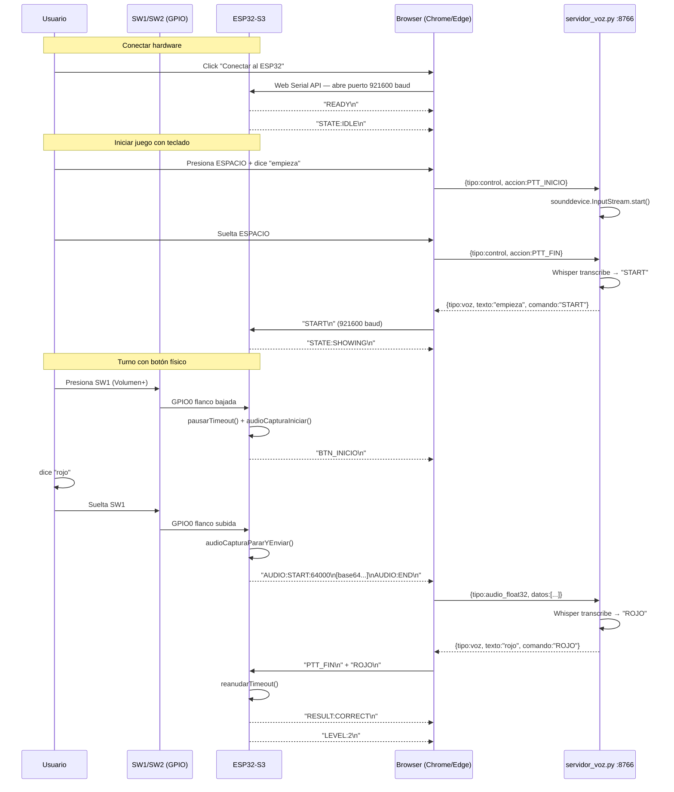
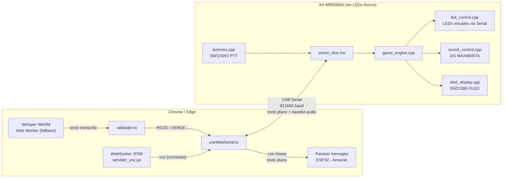
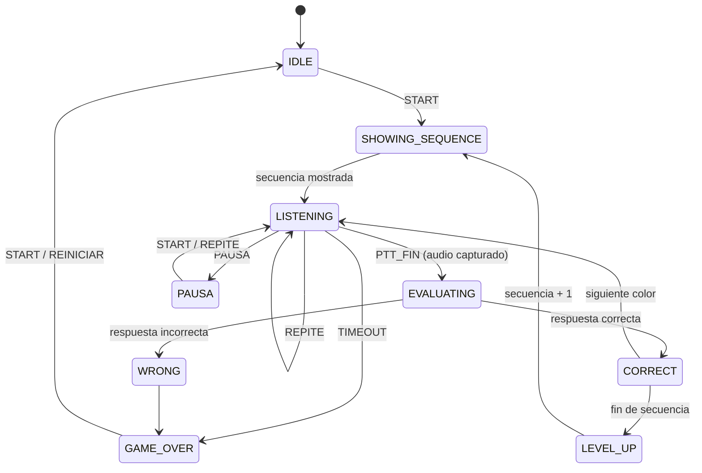

# Arquitectura — Simon Dice por Voz

## Visión general

El sistema tiene dos modos de operación, ambos usan el mismo Web Panel en Next.js:

| Modo             | Cuándo usarlo                   | Requiere                      |
| ---------------- | ------------------------------- | ----------------------------- |
| **Simulador PC** | Pruebas sin hardware            | Python + Chrome/Edge          |
| **Modo ESP32**   | Con kit ESP32 real (producción) | Kit + cable USB + Chrome/Edge |

***

## Diagrama general del sistema

> Ver diagrama detallado en [diagrama_arquitectura_completa.md](diagrama_arquitectura_completa.md)

```mermaid
graph TD
  subgraph SIMULADOR["Modo Simulador PC"]
    PY["Python main.py\n(motor del juego)"]
    WS["ws_server.py\nWebSocket :8765"]
    MIC["sounddevice\n(micrófono sistema)"]
    TTS["edge-tts / SAPI\n(narrador TTS)"]
    WHISPER_PY["openai-whisper\n(modelo small)"]
    PY --> WS
    PY --> TTS
    WS --> MIC --> WHISPER_PY
  end

  subgraph PANEL["Web Panel — Chrome/Edge"]
    PAGE["page.tsx\n(dashboard)"]
    WS_HOOK["useWebSocket.ts"]
    SERIAL_HOOK["useWebSerial.ts"]
    WASM["useWhisperWASM.ts\n+ whisper.worker.ts"]
    VAL["validador.ts"]
    PAGE --> WS_HOOK & SERIAL_HOOK
    WASM --> VAL
  end

  subgraph ESP32["Modo Hardware — Kit MRD085A"]
    FW["Firmware C++\n(ESP32-S3-N16R8)"]
    GAME["game_engine.cpp\n(máquina de estados)"]
    LEDS["led_control.cpp\n(4 LEDs físicos)"]
    SND["sound_control.cpp\n(speaker MAX98357A I2S)"]
    OLED["oled_display.cpp\n(SSD1306 0.91\")"]
    BTN["botones.cpp\n(SW1/SW2 PTT físico)"]
    FW --> GAME --> LEDS & SND & OLED
    BTN --> FW
  end

  subgraph VZ["Servidor de Voz (opcional)"]
    SRV["servidor_voz/main.py\nWebSocket :8766\nWhisper Python"]
  end

  WS_HOOK <-->|"WebSocket JSON\nws://localhost:8765"| WS
  SERIAL_HOOK <-->|"Web Serial\n921600 baud\ntexto plano + base64 audio"| FW
  SERIAL_HOOK <-->|"WebSocket JSON\nws://localhost:8766\naudio Float32"| SRV
  WASM -->|"texto transcrito (fallback)"| SERIAL_HOOK
```

***

## Modo Simulador PC

El simulador replica el comportamiento del ESP32 en la PC: corre el motor del juego,
simula los LEDs en la terminal y reproduce tonos y TTS por el speaker del sistema.

### Reconocimiento de voz — modo DUAL



**Preferido — Whisper local en Python:**

- Python captura el micrófono del sistema directamente con `sounddevice`
- El browser **NO** necesita permisos de micrófono
- Browser envía `PTT_INICIO` / `PTT_FIN` al presionar/soltar el botón o barra espaciadora
- Python graba, transcribe con `openai-whisper` (modelo `small`) y devuelve texto+comando

**Fallback — Whisper WASM en browser:**

- Solo se activa si Python no tiene Whisper instalado
- El browser descarga el modelo (`onnx-community/whisper-small`, \~125 MB, se cachea)
- El browser captura el micrófono con Web Audio API (modo PTT)

### Flujo PTT completo (Whisper local)



### Narrador TTS



**Eventos narrados:**

- Conexión: bienvenida + instrucciones ("presiona el botón y di empieza")
- SHOWING: "Mira y escucha." + nombre de cada color al mostrarlo
- LISTENING: "Tu turno. Presiona el botón para hablar."
- CORRECT: "Correcto."
- LEVEL\_UP: "Nivel N."
- WRONG: "Incorrecto. Di empieza para intentar de nuevo."
- TIMEOUT: "Tiempo agotado. Di empieza para intentar de nuevo."
- GAME\_OVER: "Fin del juego. Obtuviste N puntos. Di empieza para volver a jugar."

***

## Modo ESP32 — Producción

El modo definitivo. Hardware: kit **MRD085A** (ESP32-S3-N16R8 + INMP441 + MAX98357A + OLED + botones SW1/SW2).
Requiere: kit + cable USB + Chrome o Edge. Python es **opcional** (mayor precisión con `servidor_voz.py`).

> Ver diagramas detallados:
> - [diagrama_hardware_esp32.md](diagrama_hardware_esp32.md) — conexiones físicas del kit
> - [diagrama_flujo_esp32.md](diagrama_flujo_esp32.md) — flujo completo paso a paso (92 pasos)

### Modos de PTT — tres opciones

| Modo | Quién captura audio | Quién transcribe | Cuándo usar |
|---|---|---|---|
| **Modo A** — botón físico SW1/SW2 | INMP441 → PSRAM → Serial base64 | servidor_voz.py (Whisper Python) | Mayor precisión, Python corriendo |
| **Modo B** — teclado (barra espaciadora) | PC mic vía sounddevice (Python) | servidor_voz.py (Whisper Python) | Sin querer usar los botones físicos |
| **Modo C** — teclado sin servidor | Browser mic vía getUserMedia | Whisper WASM (Web Worker) | Sin Python, solo kit + cable USB |

### Cómo funciona — paso a paso (Modo A con botón físico)



### Diagrama de comunicación Serial



### Mensajes del protocolo Serial

**ESP32 → browser:**

```
READY               sistema inicializado
STATE:IDLE          esperando inicio
STATE:SHOWING       mostrando secuencia de LEDs
STATE:LISTENING     esperando respuesta del jugador
STATE:EVALUATING    procesando respuesta
STATE:GAMEOVER      fin del juego
STATE:PAUSA         juego pausado
LED:ROJO            LED rojo encendido
LED:OFF             LEDs apagados
RESULT:CORRECT      respuesta correcta
RESULT:WRONG        respuesta incorrecta
RESULT:TIMEOUT      no habló a tiempo
SEQUENCE:ROJO,AZUL  secuencia completa del nivel
EXPECTED:VERDE      color esperado en este turno
LEVEL:3             nivel actual
SCORE:30            puntuación actual
BTN_INICIO          botón físico SW1/SW2 presionado (inicia captura INMP441)
AUDIO:START:N       inicio de transmisión de audio (N = número de muestras)
<base64 líneas>     líneas de 60 chars base64 (45 bytes raw por línea)
AUDIO:END           fin de transmisión de audio
AUDIO:VACIO         botón soltado sin capturar audio suficiente
```

**browser → ESP32:**

```
ROJO\n              comando de color reconocido
START\n STOP\n etc  comandos de control
DESCONOCIDO\n       no se entendió
PTT_INICIO\n        teclado presionado (pausa timeout)
PTT_FIN\n           teclado soltado (reanuda timeout)
```

***

## Máquina de estados del juego



***

## IA — Whisper

| <br />               | Whisper local (Python)     | Whisper WASM (browser)           |
| -------------------- | -------------------------- | -------------------------------- |
| Librería             | `openai-whisper`           | `@huggingface/transformers` v3   |
| Modelo               | `small` (244 MB)           | `small` cuantizado INT8 (125 MB) |
| Micrófono            | Python `sounddevice`       | Web Audio API                    |
| Permisos mic browser | No necesita                | Sí                               |
| Latencia (CPU)       | 2–8 s                      | 1–3 s                            |
| Caché                | carpeta `~/.cache/whisper` | IndexedDB del browser            |
| Disponible en        | Solo simulador PC          | Simulador (fallback) + ESP32     |

***

## Componentes UI — Web Panel

El dashboard principal (`page.tsx`) ensambla los siguientes componentes:

| Componente          | Descripción                                                                                                                  |
| ------------------- | ---------------------------------------------------------------------------------------------------------------------------- |
| **ConnectionPanel** | Toggle de modo (WebSocket / Serial), botón PTT con indicador de estado, información del dispositivo detectado, botón conectar |
| **LEDPanel**        | Visualización de los 4 LEDs de colores (Rojo, Verde, Azul, Amarillo) que refleja el estado de los LEDs físicos o simulados  |
| **GameStatus**      | Badge del estado actual del juego, última detección de voz, y pista de uso del PTT                                          |
| **ScoreBoard**      | Nivel y puntuación actuales con animación de números al actualizarse                                                         |
| **SequenceDisplay** | Secuencia de pasos compacta (cajas de color w-6 h-6), muestra la secuencia completa del nivel actual                        |
| **LogConsole**      | Log en tiempo real de todos los eventos, los más nuevos al fondo con auto-scroll, filtrable por tipo de mensaje              |
| **TurnoTimer**      | Cuenta regresiva de 30 s durante el estado LISTENING (comienza después del retraso TTS de 3,5 s); muestra referencia de comandos de voz cuando está en reposo |
| **SesionStats**     | Estadísticas de la sesión actual: mejor nivel, mejor puntuación, total de partidas y mejor racha, persistidas en memoria     |
| **HowToPlay**       | Modal de ayuda con instrucciones del juego, lista de comandos de voz reconocidos y notas de compatibilidad del navegador     |

***

## Estructura de carpetas

```
sistemas-inteligentes/
│
├── firmware/                C++ Arduino — corre en el ESP32-S3 (Kit MRD085A)
│   ├── simon_dice.ino       entry point, setup() y loop()
│   ├── vocabulario.h        ÚNICA fuente del vocabulario de comandos
│   ├── game_engine.h/cpp    máquina de estados (TIMEOUT_RESPUESTA=15000ms)
│   ├── led_control.h/cpp    control de los 4 LEDs físicos
│   ├── sound_control.h/cpp  tonos I2S por speaker MAX98357A
│   ├── audio_capture.h/cpp  captura PTT INMP441 → PSRAM → base64 Serial
│   ├── serial_comm.h/cpp    protocolo de texto por USB Serial (921600 baud)
│   ├── oled_display.h/cpp   display SSD1306 0.91" I2C (estado + nivel + pts)
│   └── botones.h/cpp        SW1/SW2 como PTT físico (GPIO0/GPIO35)
│
├── servidor_voz/            Python — servidor de voz solo (sin lógica de juego)
│   ├── main.py              WebSocket :8766, Whisper Python, PTT mic PC + audio base64
│   ├── config_voz.py        WS_PORT, WHISPER_MODEL, SAMPLE_RATE
│   └── requirements.txt     sounddevice, numpy, websockets, openai-whisper
│
├── tests/
│   └── simulador_pc/
│       ├── main.py          entry point: juego + WebSocket + hilos
│       ├── juego_sim.py     lógica del juego (espejo de game_engine.cpp)
│       ├── audio_pc.py      sounddevice (tonos + mic PTT) + edge-tts/SAPI
│       ├── leds_sim.py      LEDs simulados en terminal (ANSI)
│       ├── ws_server.py     WebSocket ↔ panel; READY con info dispositivos
│       ├── validador.py     normaliza texto → comando
│       ├── config_test.py   WHISPER_MODEL, TIMEOUT_RESPUESTA, SAMPLE_RATE
│       └── requirements_test.txt
│
├── web-panel/               Next.js 14 + TypeScript
│   ├── app/
│   │   ├── page.tsx         dashboard principal
│   │   └── components/      GameStatus, LEDPanel, SequenceDisplay,
│   │                        LogConsole, ScoreBoard, ConnectionPanel,
│   │                        TurnoTimer, SesionStats, HowToPlay
│   ├── hooks/
│   │   ├── useWebSocket.ts      modo simulador (WebSocket :8765)
│   │   ├── useWebSerial.ts      modo ESP32 (Serial 921600 + WS :8766)
│   │   └── useWhisperWASM.ts    Whisper WASM (fallback sin servidor)
│   ├── workers/
│   │   └── whisper.worker.ts    Web Worker con @huggingface/transformers
│   ├── lib/
│   │   └── validador.ts         texto → comando
│   └── types/game.ts
│
└── docs/
    ├── arquitectura.md              (este archivo)
    ├── diagrama_arquitectura_completa.md  tres modos lado a lado
    ├── diagrama_hardware_esp32.md   conexiones físicas kit MRD085A
    ├── diagrama_flujo_esp32.md      flujo completo ESP32 (92 pasos)
    ├── diagrama_opcion_c.md         flujo ESP32 + Whisper WASM sin Python
    ├── diagrama_simulador_pc.md     flujo simulador PC
    └── setup.md
```

***

## Modos del panel

| Modo | Toggle | Cuándo usar | Python necesario |
|---|---|---|---|
| **Simulador — WebSocket** | "WebSocket" | `python main.py` corriendo en PC | Sí (obligatorio) |
| **ESP32 + servidor_voz** | "Serial" | Kit MRD085A + `python servidor_voz/main.py` | Sí (mayor precisión) |
| **ESP32 + WASM** | "Serial" | Kit MRD085A, sin Python instalado | No |

> **PTT físico**: botones SW1/SW2 del kit → captura INMP441 → base64 → servidor_voz → Whisper
> **PTT teclado**: barra espaciadora en browser → mic PC → servidor_voz (preferido) o WASM (fallback)

