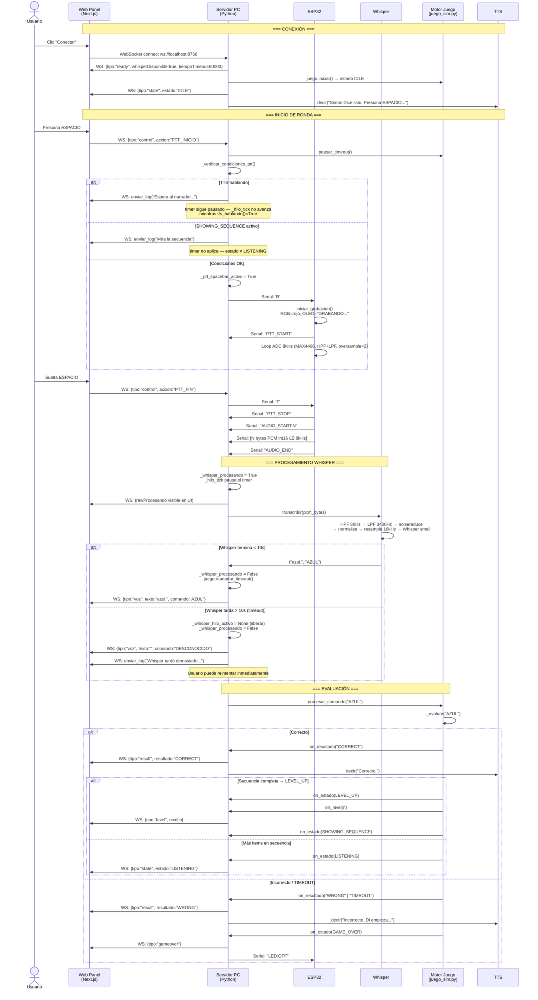
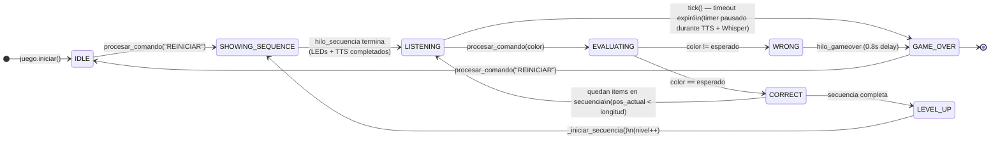
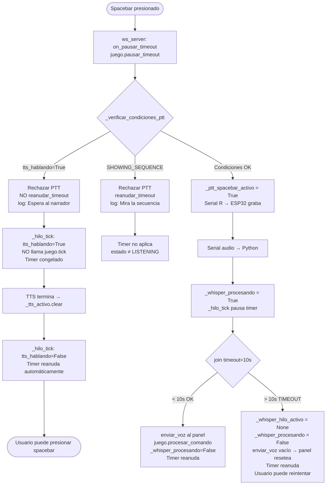
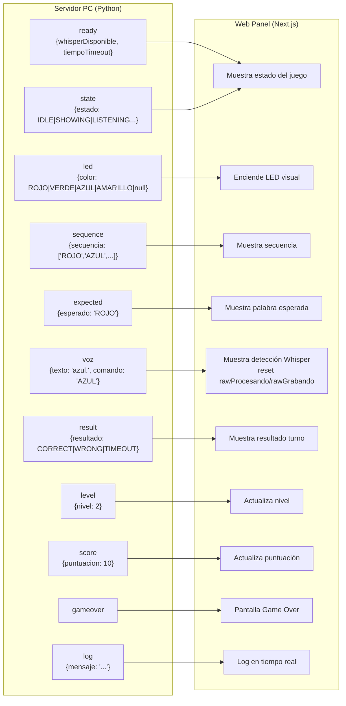

# Arquitectura y Flujo — Simon Dice por Voz

## Diagrama 1: Flujo de una ronda completa (camino feliz)

---

## Diagrama 2: Máquina de estados del juego

---

## Diagrama 3: Sincronización TTS ↔ Timer ↔ PTT

---

## Diagrama 4: Protocolo de mensajes WebSocket (Servidor → Panel)

---

## Resumen de hilos concurrentes

| Hilo | Nombre | Responsabilidad |
|------|--------|-----------------|
| Principal | `main` | Arranque, bucle `while True` |
| WS server | `ws-server` | asyncio loop — recibe/envía WebSocket |
| Serial reader | `serial-reader` | Lee stream Serial del ESP32 |
| Audio proc | `audio-proc` (spawneado) | Recibe PCM, llama Whisper |
| Whisper | `whisper-transcribe` | Transcripción (con timeout 10s) |
| TTS worker | `tts-worker` | Reproduce cola TTS |
| Tick | `tick` | Verifica timeout del turno cada 200ms |
| Secuencia | `seq` | Muestra LEDs de la secuencia (bloqueante) |
| Nivel up | `nivel-up` | Delay 0.6s → nuevo nivel |
| Game over | `gameover` | Delay 0.8s → GAME_OVER |
| Bienvenida | `bienvenida` | TTS de bienvenida al conectar |
