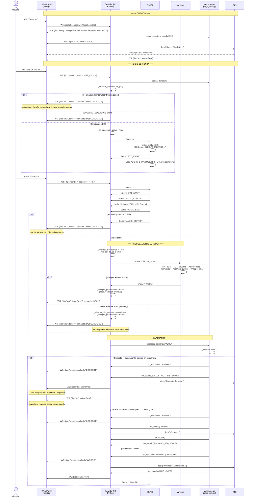
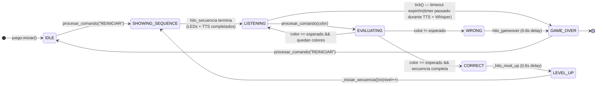
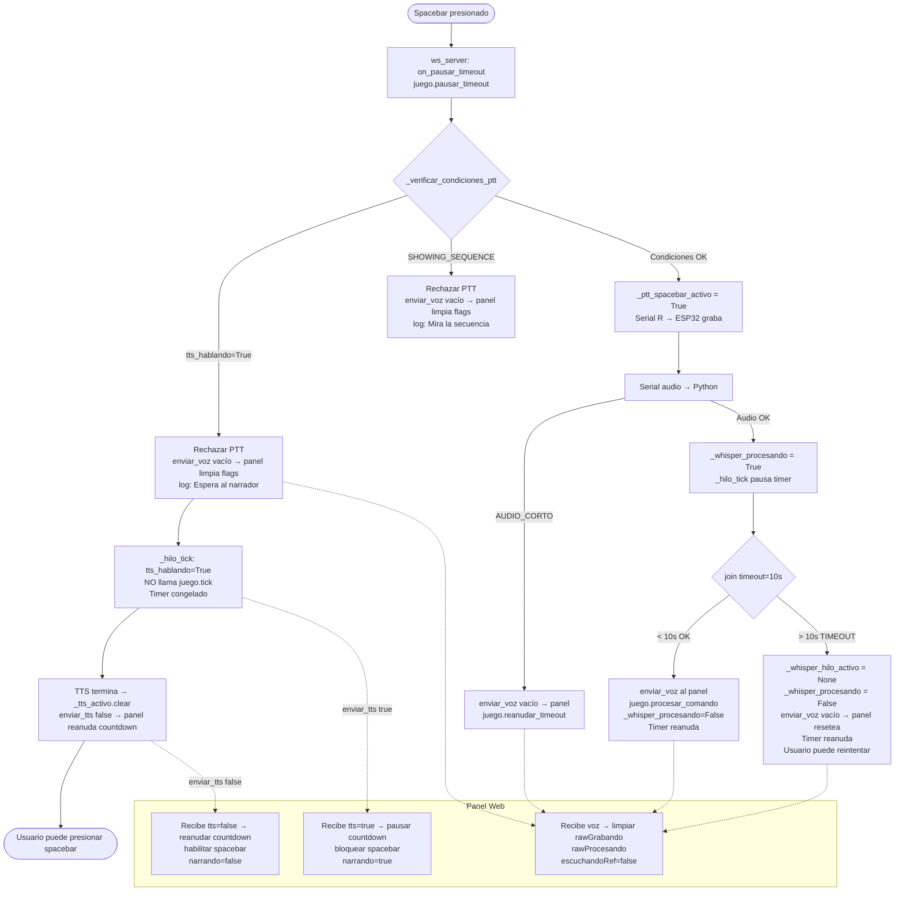
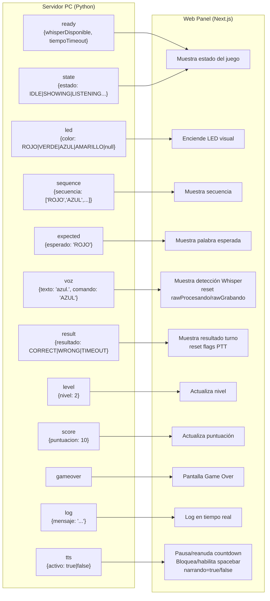
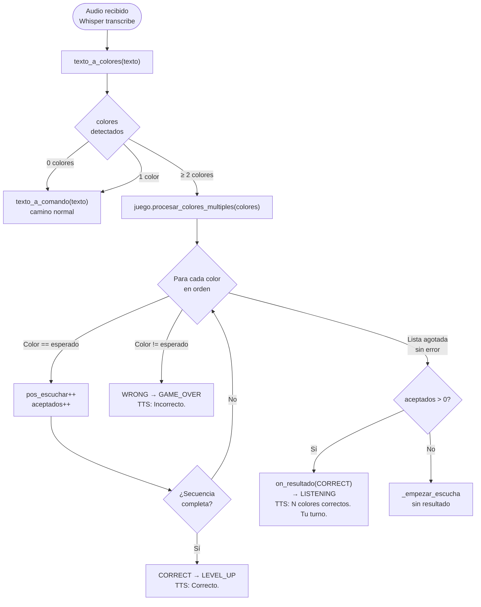

# Arquitectura y Flujo — Simon Dice por Voz

## Diagrama 1: Flujo de una ronda completa (camino feliz)

---

## Diagrama 2: Máquina de estados del juego

---

## Diagrama 3: Sincronización TTS ↔ Timer ↔ PTT ↔ Panel

---

## Diagrama 4: Protocolo de mensajes WebSocket (Servidor → Panel)

---

## Diagrama 5: Modo Multi-Color (varios colores en un solo audio)

### Reglas de corte en `texto_a_colores()`

| Texto de Whisper | Resultado | Razón |
|-----------------|-----------|-------|
| `"azul rojo rojo amarillo"` | `[AZUL, ROJO, ROJO, AMARILLO]` | Todo reconocido |
| `"adul dojo amadillo"` | `[AZUL, ROJO, AMARILLO]` | Fuzzy matching |
| `"azul rojo sdadsa verde"` | `[AZUL, ROJO]` | Para en sdadsa |
| `"sdadsa rojo rojo"` | `[]` | Primera palabra falla → camino normal |
| `"reiniciar"` | `[]` | No es color → `texto_a_comando` → REINICIAR |
| `"azul"` (solo 1) | `[AZUL]` → usa camino normal | < 2 colores |

---

## Resumen de hilos concurrentes

| Hilo | Nombre | Responsabilidad |
|------|--------|-----------------|
| Principal | `main` | Arranque, bucle `while True` |
| WS server | `ws-server` | asyncio loop — recibe/envía WebSocket |
| Serial reader | `serial-reader` | Lee stream Serial del ESP32 |
| Audio proc | `audio-proc` (spawneado) | Recibe PCM, llama Whisper |
| Whisper | `whisper-transcribe` | Transcripción (con timeout 10s) |
| TTS worker | `tts-worker` | Reproduce cola TTS |
| Tick | `tick` | Verifica timeout del turno cada 200ms; detecta transiciones TTS → notifica panel |
| Secuencia | `seq` | Muestra LEDs de la secuencia (bloqueante) |
| Nivel up | `nivel-up` | Delay 0.6s → nuevo nivel |
| Game over | `gameover` | Delay 0.8s → GAME_OVER |
| Bienvenida | `bienvenida` | TTS de bienvenida al conectar |

---

## OLED del ESP32 — Mensajes por estado

| Estado | Línea 1 | Línea 2 | Línea 3 |
|--------|---------|---------|---------|
| IDLE | Simon Dice | Di EMPIEZA | para comenzar |
| SHOWING_SEQUENCE | MOSTRANDO | secuencia | — |
| LISTENING | TU TURNO | Nv2 Pts:10 1/2 | Presiona ESPACIO |
| EVALUATING | Procesando... | Whisper | — |
| CORRECT | CORRECTO! | — | — |
| LEVEL_UP | NIVEL 3! | Puntos: 20 | Bien hecho! |
| WRONG | INCORRECTO | — | — |
| GAME_OVER | GAME OVER | — | Di EMPIEZA |
| PAUSA | PAUSA | Di EMPIEZA | para continuar |

*LISTENING es dinámico: nivel y puntuación actuales, posición en secuencia.*
