```mermaid
%%{init: {"flowchart": {"htmlLabels": false}} }%%
flowchart TD

    subgraph MODO_SIM ["MODO A — Simulador PC · solo software"]
        SIM_BOOT(["python main.py"])
        SIM_JUEGO["juego_sim.py\nmotor del juego\nmaquina de estados"]
        SIM_WS[/"ws_server.py\nWebSocket :8765\nbidireccional"/]
        SIM_MIC[("sounddevice\nmic del sistema\nInputStream 16kHz")]
        SIM_WHISPER[["Whisper Python small\ntranscripcion local\nsin internet"]]
        SIM_TTS[/"TTS edge-tts o SAPI\nsintesis de voz\nen espanol"/]
        SIM_LED[("Terminal ANSI\nLEDs virtuales\ncolores en consola")]

        SIM_BOOT --> SIM_JUEGO
        SIM_JUEGO <--> SIM_WS
        SIM_MIC --> SIM_WHISPER
        SIM_WHISPER --> SIM_JUEGO
        SIM_JUEGO --> SIM_TTS
        SIM_JUEGO --> SIM_LED
    end

    subgraph MODO_ESP_PY ["MODO B — ESP32 + Python Whisper · RECOMENDADO"]
        ESP_CHIP(["Kit MRD085A\nESP32-S3-N16R8\n240MHz 8MB PSRAM"])
        ESP_MIC[("INMP441\nI2S0 16kHz 16bit\nSCK=12 WS=13 SD=11")]
        ESP_SPK[("MAX98357A\nI2S1 amplificador\nBCLK=5 WS=4 DIN=6")]
        ESP_OLED[("OLED 0.91 SSD1306\nI2C SDA=21 SCL=22\nestado nivel puntos")]
        ESP_BTN[("SW1 GPIO0 · SW2 GPIO35\nPTT fisico\nbotones Volumen")]
        ESP_LEDS[("4 LEDs GPIO 15-18\nROJO VERDE AZUL\nAMARI LLO")]
        ESP_SER[/"Serial 921600 baud\nprotocolo texto plano\nREADY STATE DETECTED etc"/]

        PY_SER["Web Serial API\nbrowser Chrome/Edge\nlectura escritura linea a linea"]
        PY_WS[/"WebSocket :8766\ncliente en browser\njson audio base64"/]
        PY_SRV["servidor_voz.py\nPython WebSocket server\nlocalhost:8766"]
        PY_WHISPER[["Whisper Python\nmodelo small o base\n~74MB descarga unica"]]
        PY_VAL[["validador.py\nnormaliza texto a COMANDO\nROJO VERDE START etc"]]

        ESP_CHIP <-->|"I2S0"| ESP_MIC
        ESP_CHIP <-->|"I2S1"| ESP_SPK
        ESP_CHIP <-->|"I2C"| ESP_OLED
        ESP_BTN -->|"GPIO IRQ"| ESP_CHIP
        ESP_CHIP -->|"GPIO"| ESP_LEDS
        ESP_CHIP <-->|"USB-C"| ESP_SER
        ESP_SER <-->|"Web Serial API"| PY_SER
        PY_SER --> PY_WS
        PY_WS <-->|"JSON audio base64"| PY_SRV
        PY_SRV --> PY_WHISPER
        PY_WHISPER --> PY_VAL
        PY_VAL -->|"comando"| PY_SER
    end

    subgraph MODO_ESP_WASM ["MODO C — ESP32 + Whisper WASM · sin Python"]
        WA_CHIP(["Kit MRD085A\nESP32-S3-N16R8\nmismo hardware"])
        WA_SER[/"Serial 921600 baud\nmismo protocolo\nREADY STATE DETECTED etc"/]
        WA_WSER["Web Serial API\nbrowser Chrome/Edge\nlectura escritura"]
        WA_WORKER["Web Worker\nWhisper WASM\n~39MB modelo cargado en cache"]
        WA_VAL[["validador.ts\nnormaliza texto a COMANDO\ntodo en el browser"]]

        WA_CHIP <-->|"USB-C"| WA_SER
        WA_SER <-->|"Web Serial API"| WA_WSER
        WA_WSER --> WA_WORKER
        WA_WORKER --> WA_VAL
        WA_VAL -->|"comando"| WA_WSER
    end

    subgraph WEB_PANEL ["WEB PANEL — Next.js 14 TypeScript · compartido por los 3 modos"]
        WP_PAGE["app/page.tsx\ndashboard principal\nClient Component"]

        subgraph WP_HOOKS ["Hooks de conexion"]
            WP_WSS["useWebSocket.ts\nconexion Modo A\nws://localhost:8765"]
            WP_WSER["useWebSerial.ts\nconexion Modo B y C\nWeb Serial API"]
            WP_WASM["useWhisperWASM.ts\nmodelo WASM en Worker\naudio Float32 a texto"]
        end

        subgraph WP_SHARED ["Logica compartida"]
            WP_VAL["validador.ts\nnormaliza respuesta Whisper\na comando del vocabulario"]
            WP_TYPES["types/game.ts\nGameState VoiceCommand\nSerialMessage etc"]
            WP_PROTO["protocolo Serial\nREADY STATE DETECTED\nRESULT LEVEL SCORE etc"]
        end

        subgraph WP_UI ["Componentes de UI"]
            WP_GS["GameStatus.tsx\nIDLE LISTENING SHOWING\nEVALUATING GAMEOVER"]
            WP_LED["LEDPanel.tsx\n4 LEDs virtuales\nrojo verde azul amarillo"]
            WP_SEQ["SequenceDisplay.tsx\nbloques de colores\nsecuencia actual"]
            WP_LOG["LogConsole.tsx\nlog en tiempo real\ntodos los eventos"]
            WP_SCR["ScoreBoard.tsx\nnivel y puntuacion\nhistorial de sesion"]
            WP_TIMER["TurnoTimer.tsx\nbarra de progreso\n5000ms countdown"]
            WP_SESS["SesionStats.tsx\npartidas jugadas\nmejor nivel racha"]
        end

        WP_PAGE --> WP_WSS
        WP_PAGE --> WP_WSER
        WP_PAGE --> WP_WASM
        WP_WASM --> WP_VAL
        WP_WSS --> WP_TYPES
        WP_WSER --> WP_TYPES
        WP_TYPES --> WP_PROTO
        WP_PAGE --> WP_GS
        WP_PAGE --> WP_LED
        WP_PAGE --> WP_SEQ
        WP_PAGE --> WP_LOG
        WP_PAGE --> WP_SCR
        WP_PAGE --> WP_TIMER
        WP_PAGE --> WP_SESS
    end

    %% Conexiones entre modos y Web Panel
    SIM_WS <-->|"WebSocket JSON :8765\nSTATE DETECTED RESULT LEVEL"| WP_WSS
    PY_SER <-->|"Web Serial texto plano 921600\nREADY STATE AUDIO DETECTED"| WP_WSER
    WA_WSER <-->|"Web Serial texto plano 921600\nmismo protocolo"| WP_WSER

    %% Deploy
    VERCEL(["Vercel CDN\nhttps://simon-dice.vercel.app\nclient-side only"])
    WP_PAGE --> VERCEL

    classDef estado fill:#0f2d4a,stroke:#4a9eff,color:#fff
    classDef decision fill:#3d2000,stroke:#ff9900,color:#fff
    classDef proceso fill:#0a2a0a,stroke:#33cc33,color:#ddd
    classDef error fill:#2a0a0a,stroke:#ff4444,color:#fff
    classDef hardware fill:#1a1500,stroke:#ddaa00,color:#fff
    classDef browser fill:#002a2a,stroke:#00cccc,color:#fff
    classDef audio fill:#1a0030,stroke:#cc44ff,color:#fff
    classDef terminal fill:#1a0a2a,stroke:#9933ff,color:#fff
    classDef webpanel fill:#002020,stroke:#00aaaa,color:#eee
    classDef deploy fill:#200020,stroke:#aa00aa,color:#eee

    class SIM_BOOT terminal
    class SIM_JUEGO,SIM_WHISPER,PY_WHISPER,PY_VAL,WA_WORKER,WA_VAL proceso
    class SIM_WS,ESP_SER,WA_SER,PY_WS,PY_SRV audio
    class SIM_MIC,SIM_LED,ESP_MIC,ESP_SPK,ESP_OLED,ESP_BTN,ESP_LEDS,WA_CHIP,ESP_CHIP hardware
    class SIM_TTS,PY_SER,WP_WSS,WP_WSER,WP_WASM,WA_WSER browser
    class WP_PAGE,WP_VAL,WP_TYPES,WP_PROTO,WP_GS,WP_LED,WP_SEQ,WP_LOG,WP_SCR,WP_TIMER,WP_SESS webpanel
    class VERCEL deploy
```

# Arquitectura Completa — Simon Dice por Voz

> Vista de alto nivel de los tres modos de operación del sistema.
> Modo Simulador PC (izquierda): todo en la computadora, sin hardware físico.
> Modo ESP32 + Python Whisper (centro): kit MRD085A + servidor Python local.
> Modo ESP32 + WASM (derecha): kit MRD085A + Whisper en el browser, sin Python.
> El Web Panel (abajo) es compartido por los tres modos.

---

---

## Comparacion de modos de operacion

| Característica | Modo A — Simulador PC | Modo B — ESP32 + Python | Modo C — ESP32 + WASM |
|---|---|---|---|
| Hardware ESP32 físico | No — solo software | Si — kit MRD085A | Si — kit MRD085A |
| Microfono | Mic del sistema (sounddevice) | INMP441 I2S integrado | INMP441 I2S integrado |
| LEDs físicos | No — ANSI terminal | Si — GPIO 15-18 | Si — GPIO 15-18 |
| Speaker físico | TTS edge-tts/SAPI | MAX98357A I2S | MAX98357A I2S |
| OLED display | No | Si — SSD1306 0.91" | Si — SSD1306 0.91" |
| Botones PTT físicos | No — VAD automático | Si — SW1/SW2 GPIO | Si — SW1/SW2 GPIO |
| Python requerido | Si — main.py siempre | Si — servidor_voz.py | No — todo en el browser |
| Modelo Whisper | Python `small` local | Python `small` local | WASM `base` en browser |
| Internet requerido | No | No | No (modelo cacheado) |
| Browser requerido | Solo para Web Panel | Si — Web Serial API | Si — Web Serial API |
| Compatibilidad browser | Chrome, Edge, Firefox, Safari | Solo Chrome y Edge | Solo Chrome y Edge |
| Descarga inicial | Whisper ~74MB (Python) | Whisper ~74MB (Python) | Whisper WASM ~39MB |
| Latencia reconocimiento | 1-3s (CPU local) | 1-3s (CPU local) | 2-5s (JS single thread) |
| Facilidad de setup | Alta — solo Python | Media — Python + ESP32 | Media — solo ESP32 |
| Uso recomendado | Prototipo / demos rápidas | Entrega principal Fase 1 | Entrega Fase 2 autónoma |

---

## Protocolo Serial compartido (Modos B y C)

| Dirección | Mensaje | Descripción |
|---|---|---|
| ESP32 → Browser | `READY` | Sistema inicializado |
| ESP32 → Browser | `STATE:LISTENING` | Esperando comando de voz |
| ESP32 → Browser | `STATE:SHOWING` | Mostrando secuencia al jugador |
| ESP32 → Browser | `STATE:EVALUATING` | Procesando respuesta |
| ESP32 → Browser | `STATE:GAMEOVER` | Fin del juego |
| ESP32 → Browser | `STATE:PAUSA` | Juego pausado |
| ESP32 → Browser | `AUDIO:START:N` | Inicio de audio (N muestras) |
| ESP32 → Browser | `AUDIO:END` | Fin de transmisión de audio |
| ESP32 → Browser | `DETECTED:ROJO` | Palabra detectada |
| ESP32 → Browser | `RESULT:CORRECT` | Respuesta correcta |
| ESP32 → Browser | `RESULT:WRONG` | Respuesta incorrecta |
| ESP32 → Browser | `RESULT:TIMEOUT` | Sin respuesta a tiempo |
| ESP32 → Browser | `SEQUENCE:R,V,A` | Secuencia actual |
| ESP32 → Browser | `EXPECTED:ROJO` | Próximo color esperado |
| ESP32 → Browser | `LEVEL:3` | Nivel actual |
| ESP32 → Browser | `SCORE:30` | Puntuación actual |
| ESP32 → Browser | `GAMEOVER` | Confirmación fin de juego |
| Browser → ESP32 | `ROJO\n` | Comando reconocido |
| Browser → ESP32 | `START\n` | Iniciar juego |
| Browser → ESP32 | `PAUSA\n` | Pausar juego |
| Browser → ESP32 | `REPITE\n` | Repetir secuencia |
| Browser → ESP32 | `PTT_INICIO\n` | Inicio de captura por teclado |
| Browser → ESP32 | `PTT_FIN\n` | Fin de captura |
