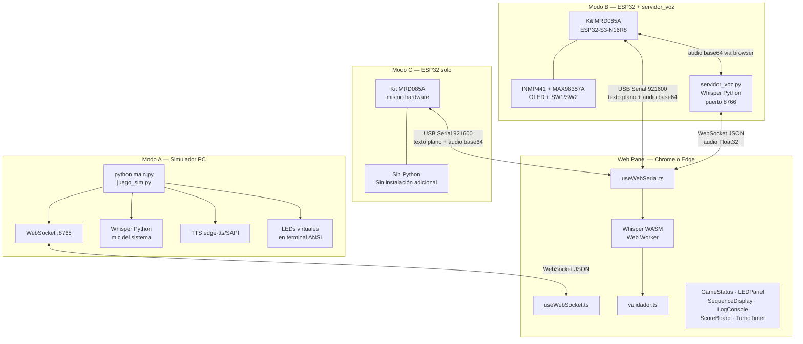
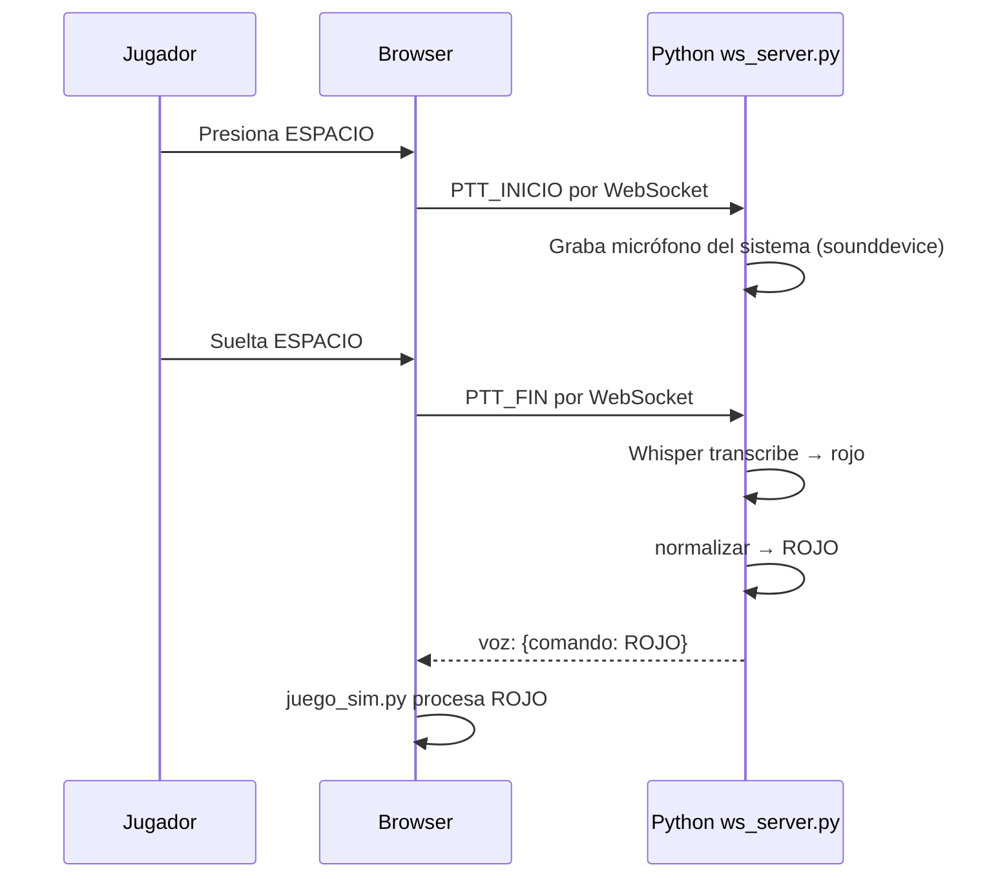
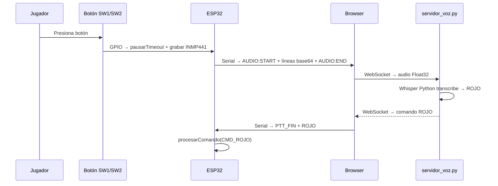
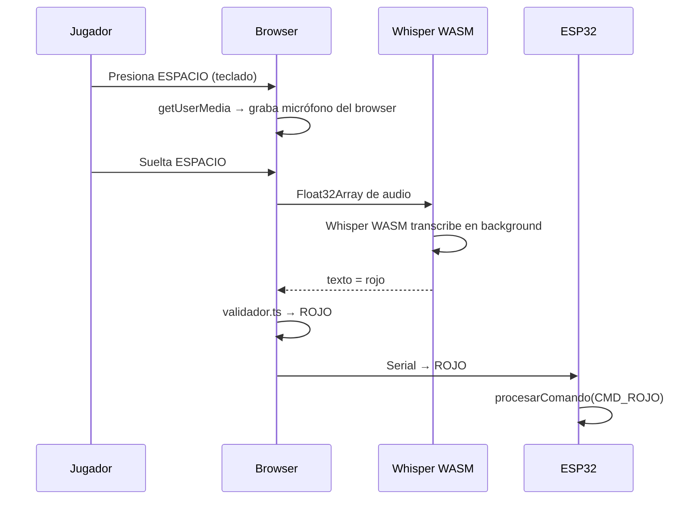

# Arquitectura completa — Tres modos de operación

> El sistema tiene tres formas de funcionar. Todos comparten el mismo Web Panel.

---

## Los tres modos de un vistazo

---

## ¿Cuándo usar cada modo?

| | Modo A — Simulador | Modo B — ESP32 + Python | Modo C — ESP32 solo |
|---|---|---|---|
| ¿Necesita hardware ESP32? | No | Sí | Sí |
| ¿Necesita Python? | Sí (obligatorio) | Sí (servidor_voz) | **No** |
| ¿Dónde corre el juego? | Python (PC) | Firmware ESP32 | Firmware ESP32 |
| ¿Quién transcribe la voz? | Whisper Python | Whisper Python | Whisper WASM en browser |
| ¿Qué micrófono usa? | Micrófono del sistema | INMP441 del kit o mic PC | INMP441 del kit o mic browser |
| ¿Hay OLED y speaker físico? | No | Sí | Sí |
| ¿Se puede desplegar en Vercel? | No | No | **Sí** |
| ¿Para qué sirve? | Pruebas sin hardware | Entrega con mayor precisión | Entrega autónoma final |

---

## Cómo funciona el reconocimiento de voz en cada modo

### Modo A — Simulador PC

### Modo B — ESP32 con servidor_voz.py

### Modo C — ESP32 sin Python

---

## Protocolo Serial — mensajes entre ESP32 y browser

**ESP32 → browser**

| Mensaje | Cuándo se envía |
|---|---|
| `READY` | Al arrancar |
| `STATE:IDLE` / `STATE:SHOWING` / `STATE:LISTENING` / etc. | Al cambiar de estado |
| `LED:ROJO` / `LED:VERDE` / `LED:AZUL` / `LED:AMARILLO` | Al mostrar un color de la secuencia |
| `LED:OFF` | Al apagar el LED del color |
| `SEQUENCE:ROJO,VERDE,AZUL` | Al iniciar cada nivel |
| `EXPECTED:ROJO` | Al entrar en LISTENING |
| `RESULT:CORRECT` / `RESULT:WRONG` / `RESULT:TIMEOUT` | Al evaluar la respuesta |
| `LEVEL:3` / `SCORE:30` | Al subir de nivel |
| `GAMEOVER` | Al terminar la partida |
| `BTN_INICIO` | Cuando el jugador presiona SW1/SW2 |
| `AUDIO:START:N` + líneas base64 + `AUDIO:END` | Audio capturado por INMP441 |

**browser → ESP32**

| Mensaje | Significado |
|---|---|
| `ROJO\n` / `VERDE\n` / `AZUL\n` / `AMARILLO\n` | Color detectado por voz |
| `START\n` / `STOP\n` / `PAUSA\n` / `REPITE\n` / `REINICIAR\n` | Comandos de control |
| `PTT_INICIO\n` / `PTT_FIN\n` | Inicio/fin de captura por teclado (pausa el timer) |
