```mermaid
%%{init: {"flowchart": {"htmlLabels": false}} }%%
flowchart TD
    BOOT(["1. INICIO: ESP32-S3 encendido · kit MRD085A"])

    subgraph HW_INIT ["HARDWARE setup() — inicializacion completa"]
        HW1["2. serialInicializar 921600 baud"] --> HW2
        HW2[("3. HW: oledInicializar SSD1306 I2C 128x32")] --> HW3
        HW3[("4. HW: ledInicializar GPIO15 16 17 18 salida")] --> HW4
        HW4[("5. HW: sonidoInicializar I2S1 MAX98357A BCLK=5 WS=4 DIN=6")] --> HW5
        HW5[["6. audioInicializar alloc 1MB en PSRAM para buffer"]] --> HW6
        HW6[("7. HW: botonesInicializar GPIO0 GPIO35 pull-up flanco")] --> HW7
        HW7[("8. HW: ledEfectoInicio secuencia flash todos los LEDs")] --> HW8
        HW8[("9. HW: sonidoInicio melodia de arranque I2S")] --> HW9
        HW9[/"10. Serial 921600: READY"/]
    end

    BOOT --> HW1
    HW9 --> OLED1

    subgraph OLED_IDLE ["OLED — pantalla estado inicial"]
        OLED1[("11. HW: OLED muestra Simon Dice + IDLE + Nivel 0")]
    end

    OLED1 --> IDLE

    subgraph BR_INIT ["BROWSER Chrome/Edge — conexion inicial"]
        BI1["12. Web Serial API detecta puerto COM del ESP32"] --> BI2
        BI2["13. Serial abierto 921600 baud · lectura linea a linea"] --> BI3
        BI3{"14. Llego READY desde ESP32?"} -->|"No: esperar 500ms"| BI3
        BI3 -->|"Si: ESP32 listo"| BI4
        BI4["15. Conectar WebSocket ws://localhost:8766 servidor_voz"] --> BI5
        BI5{"16. WS conectado con servidor_voz?"}
        BI5 -->|"No: modo sin servidor fallback WASM"| BI6
        BI5 -->|"Si: Whisper Python disponible"| BI7
        BI6["17. Activar Whisper WASM en Web Worker como respaldo"]
        BI7["17b. Badge servidor_voz conectado silenciosamente"]
    end

    IDLE(["18. ESTADO: IDLE — ESP32 espera START"])
    IDLE --> PTT_CHECK

    PTT_CHECK{"19. Como inicia el PTT?"}
    PTT_CHECK -->|"Modo A: boton fisico SW1 o SW2"| BTN1
    PTT_CHECK -->|"Modo B: teclado ESPACIO en browser"| KB1
    PTT_CHECK -->|"Modo C: VAD automatico en browser"| VAD1

    subgraph PTT_BTN ["MODO A — PTT por boton fisico INMP441"]
        BTN1[("20. HW: GPIO0 o GPIO35 flanco de bajada detectado")] --> BTN2
        BTN2[["21. pausarTimeout congelar timer de respuesta"]] --> BTN3
        BTN3[("22. HW: audioCapturaIniciar I2S0 SCK=12 WS=13 SD=11")] --> BTN4
        BTN4[/"23. Serial: BTN_INICIO · browser muestra Grabando INMP441"/] --> BTN5
        BTN5["24. OLED: Escuchando..."] --> AUDIO_LOOP
    end

    subgraph PTT_KB ["MODO B — PTT por teclado en browser"]
        KB1["25. Tecla ESPACIO presionada en Web Panel"] --> KB2
        KB2[/"26. Serial: PTT_INICIO · browser inicia captura mic del sistema"/] --> KB3
        KB3["27. getUserMedia microfono del sistema"] --> AUDIO_LOOP
    end

    subgraph PTT_VAD ["MODO C — VAD automatico continuo en browser"]
        VAD1["28. ScriptProcessorNode activo en browser"] --> VAD2
        VAD2{"29. RMS mayor 0.025 por 2 bloques consecutivos?"} -->|"No: silencio"| VAD2
        VAD2 -->|"Si: voz detectada"| AUDIO_LOOP
    end

    subgraph AUDIO_LOOP ["CAPTURA DE AUDIO — acumulacion en PSRAM"]
        AL1["30. audioCapturaLoop tick cada 10ms"] --> AL2
        AL2["31. Leer bloque I2S INMP441 16kHz 16bit 512 samples"] --> AL3
        AL3["32. Copiar muestras a buffer PSRAM acumulado"] --> AL4
        AL4{"33. Boton suelto o silencio 1.5s o limite 8s?"}
        AL4 -->|"No: audio continua"| AL2
        AL4 -->|"Si: fin del enunciado"| AL5
        AL5[["34. audioCapturaPararYEnviar calcular N muestras totales"]] --> AL6
        AL6[/"35. Serial: AUDIO:START:N · numero de muestras"/] --> AL7
        AL7["36. Codificar buffer PSRAM en base64 chunks de 512 bytes"] --> AL8
        AL8[/"37. Serial: base64 chunk a chunk"/] --> AL9
        AL9[/"38. Serial: AUDIO:END · fin de transmision"/]
    end

    subgraph BR_AUDIO ["BROWSER — decodificacion y envio al servidor"]
        BA1["39. browser acumula lineas base64 hasta AUDIO:END"] --> BA2
        BA2[["40. decodificar base64 a ArrayBuffer"]] --> BA3
        BA3[["41. convertir Int16 a Float32Array audio_float32"]] --> BA4
        BA4[/"42. WebSocket JSON: tipo:audio datos:float32 al servidor_voz"/]
    end

    subgraph SRV_PROC ["SERVIDOR Python localhost:8766 — Whisper"]
        SP1["43. servidor_voz.py recibe JSON con audio Float32"] --> SP2
        SP2[["44. convertir Float32 a array NumPy 16kHz"]] --> SP3
        SP3[["45. Whisper small transcribe idioma es"]] --> SP4
        SP4{"46. Alucinacion o sin vocabulario?"}
        SP4 -->|"Si: descartar"| SP5
        SP4 -->|"No: texto valido"| SP6
        SP5["47. WS respuesta: tipo:error mensaje:sin_comando"]
        SP6[["48. validador.py normaliza texto a COMANDO"]] --> SP7
        SP7[/"49. WS respuesta JSON: tipo:voz texto:rojo comando:ROJO"/]
    end

    AL9 --> BA1
    BA4 --> SP1

    subgraph BR_CMD ["BROWSER — reenvio de comando al ESP32"]
        BC1["50. browser recibe JSON con comando ROJO VERDE etc"] --> BC2
        BC2[/"51. Serial write: PTT_FIN + ROJO salto de linea"/] --> BC3
        BC3["52. Panel actualiza DetectedWord en tiempo real"]
    end

    SP7 --> BC1
    SP5 --> IDLE

    BC2 --> CMD1

    subgraph OLED_UPDATE ["OLED — actualizar en cada estado"]
        OU1[("OL1. HW: OLED muestra estado actual + nivel + puntos")]
    end

    CMD1{"53. ESP32 recibe en game_engine.cpp — que comando?"}
    CMD1 -->|"DESCONOCIDO"| IDLE
    CMD1 -->|"STOP"| GAMEOVER
    CMD1 -->|"PAUSA"| PA1
    CMD1 -->|"REPITE"| SQ1_REPITE
    CMD1 -->|"START"| R1
    CMD1 -->|"color detectado"| EV1

    SQ1_REPITE["54. REPITE: regresar al inicio de la secuencia"]
    SQ1_REPITE --> SQ1

    subgraph REINICIO ["NUEVA PARTIDA — game_engine.cpp"]
        R1["55. nivel=1 puntuacion=0 pos=0 seed=millis"] --> R2
        R2["56. Generar secuencia aleatoria hasta MAX_NIVEL=20"] --> R3
        R3[/"57. Serial: STATE:SHOWING + SEQUENCE:col1,col2,..."/]
    end

    R3 --> SQ1
    R3 --> OU1

    subgraph SECUENCIA ["SHOWING — led_control.cpp + sound_control.cpp"]
        SQ1[/"58. Serial: STATE:SHOWING al panel"/] --> SQ2
        SQ2[("59. HW: GPIO HIGH LED del color actual 800ms")] --> SQ3
        SQ3[("60. HW: I2S1 MAX98357A tono especifico del color")] --> SQ4
        SQ4[/"61. Serial: LED:COLOR nombre en mayusculas"/] --> SQ5
        SQ5[("62. HW: GPIO LOW LED apagado pausa 300ms")] --> SQ6
        SQ6[/"63. Serial: LED:OFF"/] --> SQ7
        SQ7{"64. Quedan mas colores en la secuencia?"}
        SQ7 -->|"Si: siguiente color"| SQ2
        SQ7 -->|"No: secuencia terminada"| SQ8
        SQ8[/"65. Serial: STATE:LISTENING + EXPECTED:color_esperado"/]
    end

    SQ8 --> LISTEN
    SQ8 --> OU1

    LISTEN(["66. ESTADO: LISTENING — timeout 5000ms"])
    LISTEN --> TMR

    subgraph TIMER_ESP ["TIMER ESP32 — conteo de timeout"]
        TMR[("67. HW: Timer hardware ESP32 contando ms")] --> TMR2
        TMR2{"68. elapsed mayor o igual a 5000ms?"}
        TMR2 -->|"No: seguir contando"| TMR
    end

    TMR2 -->|"Si: tiempo agotado"| TX1

    subgraph TOUT ["TIMEOUT — sin respuesta del jugador"]
        TX1[/"69. Serial: RESULT:TIMEOUT al panel"/] --> TX2
        TX2[("70. HW: MAX98357A tono de error I2S")] --> TX3
        TX3[("71. HW: LEDs parpadean 3 veces en rojo")]
    end

    TX3 --> GAMEOVER

    subgraph PAUSADO ["PAUSA — timer detenido"]
        PA1[/"72. Serial: STATE:PAUSA timer detenido"/] --> PA2
        PA2[("73. HW: OLED muestra PAUSA en pantalla")] --> PA3
        PA3{"74. Se recibio START o PAUSA para reanudar?"}
        PA3 -->|"No: seguir esperando voz"| PA3
    end

    PA3 -->|"Si: reanudar"| SQ8

    subgraph EVAL ["EVALUATING — comparar respuesta"]
        EV1[/"75. Serial: STATE:EVALUATING"/] --> EV2
        EV2{"76. cmd recibido igual al color esperado?"}
    end

    EV2 -->|"Si: correcto"| EV3
    EV3{"77. Fin de la secuencia? pos igual a nivel"}

    EV3 -->|"No: sigue la secuencia"| EV4
    EV4[/"78. Serial: RESULT:CORRECT pos++ EXPECTED:siguiente"/] --> SQ8

    EV3 -->|"Si: nivel superado"| LV1

    subgraph NIVEL ["LEVEL UP — subir nivel"]
        LV1["79. puntuacion += nivel x 10 · nivel++"] --> LV2
        LV2[("80. HW: MAX98357A tonos ascendentes de acierto")] --> LV3
        LV3[("81. HW: Todos los LEDs flash de celebracion")] --> LV4
        LV4[/"82. Serial: LEVEL:N + SCORE:P al panel"/]
    end

    LV4 --> OU1
    LV4 -->|"nivel nuevo: mostrar secuencia +1"| SQ1

    EV2 -->|"No: respuesta incorrecta"| WR1

    subgraph INCORRECTO ["WRONG — respuesta incorrecta"]
        WR1[/"83. Serial: RESULT:WRONG al panel"/] --> WR2
        WR2[("84. HW: MAX98357A tono de error grave")] --> WR3
        WR3[("85. HW: LEDs parpadean 3 veces todos juntos")] --> WR4
        WR4["86. delay 800ms antes de game over"]
    end

    WR4 --> GAMEOVER

    subgraph GOVER ["GAME OVER — fin de la partida"]
        GAMEOVER[/"87. Serial: STATE:GAMEOVER al panel"/] --> GV1
        GV1[("88. HW: Todos GPIO LOW LEDs apagados")] --> GV2
        GV2[("89. HW: MAX98357A melodia de game over I2S")] --> GV3
        GV3[/"90. Serial: GAMEOVER + SCORE:P"/] --> GV4
        GV4[("91. HW: OLED muestra GAME OVER + puntaje final")]
    end

    GV4 --> FIN
    FIN{"92. Browser detecta START o REINICIAR via voz?"}
    FIN -->|"No: seguir escuchando"| FIN
    FIN -->|"Si: nueva partida"| R1

    classDef estado fill:#0f2d4a,stroke:#4a9eff,color:#fff
    classDef decision fill:#3d2000,stroke:#ff9900,color:#fff
    classDef proceso fill:#0a2a0a,stroke:#33cc33,color:#ddd
    classDef error fill:#2a0a0a,stroke:#ff4444,color:#fff
    classDef hardware fill:#1a1500,stroke:#ddaa00,color:#fff
    classDef browser fill:#002a2a,stroke:#00cccc,color:#fff
    classDef audio fill:#1a0030,stroke:#cc44ff,color:#fff
    classDef terminal fill:#1a0a2a,stroke:#9933ff,color:#fff

    class IDLE,LISTEN estado
    class PTT_CHECK,CMD1,EV2,EV3,SQ7,TMR2,FIN,PA3,BI3,BI5,VAD2,AL4,SP4,SP5 decision
    class HW1,HW2,HW5,R1,R2,R3,SQ8,EV4,LV1,WR4,TX1,AL5,AL6,BC1,BC2,SP6,SP7,SQ1_REPITE proceso
    class WR1,WR2,TX2,GAMEOVER,GV3 error
    class BOOT terminal
    class HW3,HW4,HW6,HW7,HW8,HW9,SQ2,SQ3,SQ5,OLED1,OU1,TMR,TX3,LV2,LV3,WR3,GV1,GV2,GV4,BTN1,BTN3,BTN5,PA2 hardware
    class BI1,BI2,BI4,BI6,BI7,KB1,KB2,KB3,BA1,BA2,BA3,BA4,BC3,VAD1,VAD2 browser
    class AL1,AL2,AL3,AL7,AL8,AL9,BTN2,BTN4,SP1,SP2,SP3,SP8 audio
```

# Diagrama de Flujo — Modo ESP32 con INMP441

> Ciclo completo del juego corriendo en el kit físico MRD085A.
> El ESP32-S3 captura voz por I2S (INMP441), la envía al browser vía Serial,
> el browser la reenvía al servidor Python (Whisper :8766), y el comando
> vuelve al ESP32 para actualizar la lógica del juego.
> Cada paso está numerado en orden de ejecución.

---

---

## Índice de pasos

| Paso | Descripción | Quién |
|---|---|---|
| 1 | INICIO: ESP32 encendido | — |
| 2 | serialInicializar 921600 | ESP32 |
| 3 | HW: OLED SSD1306 I2C | ESP32 |
| 4 | HW: LEDs GPIO 15-18 | ESP32 |
| 5 | HW: MAX98357A I2S1 | ESP32 |
| 6 | audioInicializar alloc PSRAM | ESP32 |
| 7 | HW: Botones GPIO0 GPIO35 | ESP32 |
| 8 | HW: ledEfectoInicio flash | ESP32 |
| 9 | HW: sonidoInicio melodia | ESP32 |
| 10 | Serial: READY | ESP32 |
| 11 | HW: OLED estado inicial | ESP32 |
| 12–17 | Browser: Web Serial conecta + WS servidor_voz | Browser |
| 18 | ESTADO: IDLE | ESP32 |
| 19 | Decision: modo PTT | ESP32 + Browser |
| 20 | HW: GPIO flanco bajada SW1/SW2 | ESP32 |
| 21 | pausarTimeout | ESP32 |
| 22 | HW: audioCapturaIniciar I2S0 | ESP32 |
| 23 | Serial: BTN_INICIO | ESP32 |
| 24 | OLED: Escuchando... | ESP32 |
| 25–27 | Modo B: teclado ESPACIO + getUserMedia | Browser |
| 28–29 | Modo C: VAD RMS > 0.025 | Browser |
| 30 | audioCapturaLoop tick 10ms | ESP32 |
| 31 | Leer bloque I2S INMP441 | ESP32 |
| 32 | Copiar muestras a PSRAM | ESP32 |
| 33 | Decision: fin del audio? | ESP32 |
| 34 | audioCapturaPararYEnviar | ESP32 |
| 35 | Serial: AUDIO:START:N | ESP32 |
| 36 | Codificar base64 | ESP32 |
| 37 | Serial: base64 chunks | ESP32 |
| 38 | Serial: AUDIO:END | ESP32 |
| 39 | Browser acumula base64 | Browser |
| 40 | Decodificar base64 a ArrayBuffer | Browser |
| 41 | Convertir Int16 a Float32 | Browser |
| 42 | WS JSON: audio Float32 al servidor | Browser |
| 43 | servidor_voz recibe JSON | Python |
| 44 | Convertir Float32 a NumPy | Python |
| 45 | Whisper transcribe idioma es | Python |
| 46 | Decision: alucinación? | Python |
| 47 | WS: error sin_comando | Python |
| 48 | validador.py normaliza a COMANDO | Python |
| 49 | WS JSON: tipo:voz comando:ROJO | Python |
| 50 | Browser recibe JSON con comando | Browser |
| 51 | Serial write: PTT_FIN + COMANDO | Browser |
| 52 | Panel actualiza DetectedWord | Browser |
| 53 | Decision: qué comando ESP32? | ESP32 |
| 54 | REPITE: regresa a secuencia | ESP32 |
| 55 | nivel=1 puntuacion=0 | ESP32 |
| 56 | Generar secuencia aleatoria | ESP32 |
| 57 | Serial: STATE:SHOWING + SEQUENCE | ESP32 |
| 58 | Serial: STATE:SHOWING | ESP32 |
| 59 | HW: GPIO HIGH LED 800ms | ESP32 |
| 60 | HW: I2S tono del color | ESP32 |
| 61 | Serial: LED:COLOR | ESP32 |
| 62 | HW: GPIO LOW pausa 300ms | ESP32 |
| 63 | Serial: LED:OFF | ESP32 |
| 64 | Decision: más colores? | ESP32 |
| 65 | Serial: STATE:LISTENING + EXPECTED | ESP32 |
| 66 | ESTADO: LISTENING timeout 5000ms | ESP32 |
| 67 | HW: Timer hardware contando | ESP32 |
| 68 | Decision: elapsed > 5000ms? | ESP32 |
| 69 | Serial: RESULT:TIMEOUT | ESP32 |
| 70 | HW: MAX98357A tono error | ESP32 |
| 71 | HW: LEDs parpadean rojo | ESP32 |
| 72 | Serial: STATE:PAUSA | ESP32 |
| 73 | HW: OLED muestra PAUSA | ESP32 |
| 74 | Decision: START o PAUSA? | ESP32 |
| 75 | Serial: STATE:EVALUATING | ESP32 |
| 76 | Decision: cmd == esperado? | ESP32 |
| 77 | Decision: secuencia completa? | ESP32 |
| 78 | Serial: RESULT:CORRECT pos++ | ESP32 |
| 79 | puntuacion += nivel x 10, nivel++ | ESP32 |
| 80 | HW: MAX98357A tonos de acierto | ESP32 |
| 81 | HW: LEDs flash de celebración | ESP32 |
| 82 | Serial: LEVEL:N + SCORE:P | ESP32 |
| 83 | Serial: RESULT:WRONG | ESP32 |
| 84 | HW: MAX98357A tono error grave | ESP32 |
| 85 | HW: LEDs parpadean todos | ESP32 |
| 86 | delay 800ms | ESP32 |
| 87 | Serial: STATE:GAMEOVER | ESP32 |
| 88 | HW: Todos GPIO LOW | ESP32 |
| 89 | HW: MAX98357A melodia gameover | ESP32 |
| 90 | Serial: GAMEOVER + SCORE:P | ESP32 |
| 91 | HW: OLED GAME OVER + puntaje | ESP32 |
| 92 | Decision: START o REINICIAR? | Browser + ESP32 |
