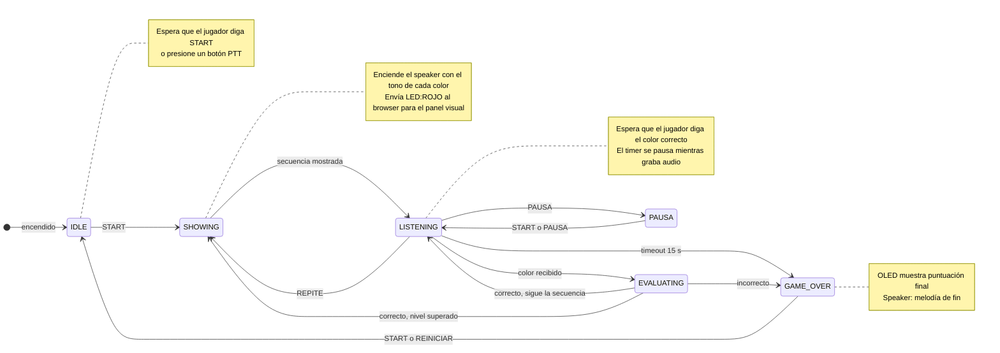
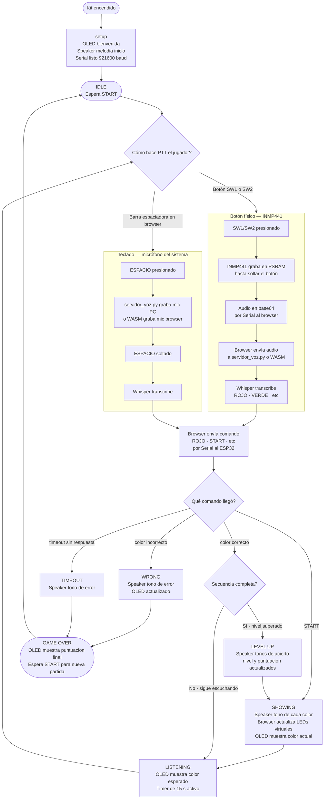
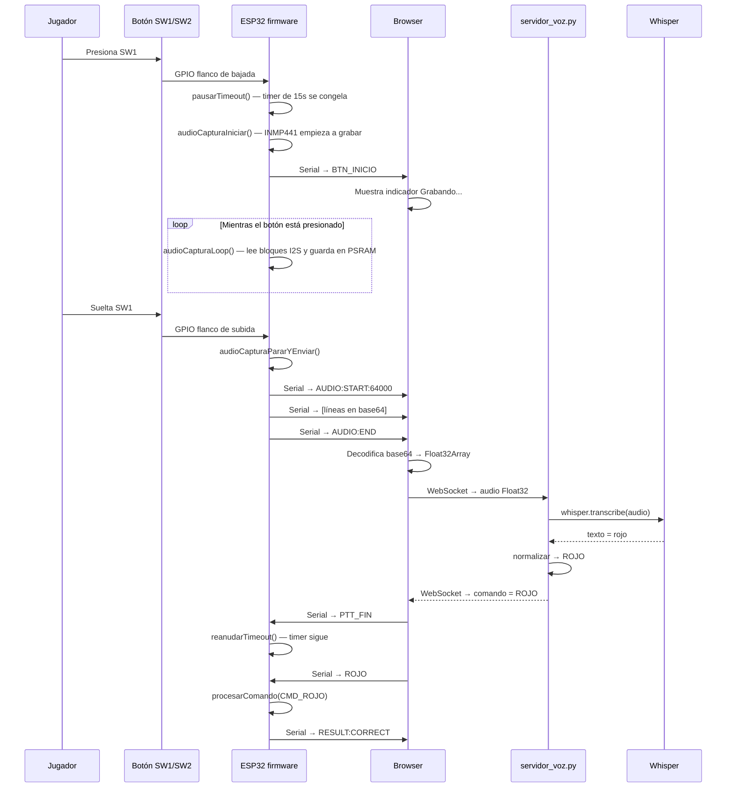

# Flujo del juego — Kit ESP32 MRD085A

> Cómo funciona una partida completa con el hardware físico.

---

## 1. Máquina de estados del juego

El ESP32 siempre está en uno de estos estados. Las transiciones ocurren por comandos de voz o por tiempo.

---

## 2. Flujo completo de una partida

---

## 3. Flujo de PTT con botón físico (detalle técnico)

Este diagrama muestra exactamente qué pasa cuando el jugador presiona SW1 o SW2.

---

## 4. Lo que el OLED muestra en cada estado

| Estado del juego | Fila 1 | Fila 2 | Fila 3 |
|---|---|---|---|
| IDLE | `IDLE` | `Nv 1` | `0 pts` |
| SHOWING | `SHOWING` | `Nv 1` | `(color actual)` |
| LISTENING | `LISTEN` | `Nv 1` | `Esp: ROJO` |
| CORRECT | `CORRECT` | `Nv 1` | `10 pts` |
| LEVEL UP | `LEVEL UP` | `Nv 2` | `10 pts` |
| WRONG | `WRONG` | — | — |
| GAME OVER | `GAME OVER` | `Pts: 10` | — |
| PAUSA | `PAUSA` | — | — |
