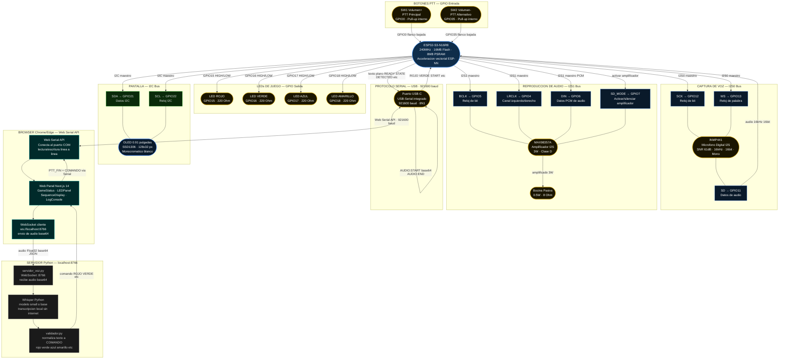

# Diagrama de Hardware — Kit MRD085A

> Conexiones físicas del kit MRD085A (ESP32-S3-N16R8).
> El chip ESP32-S3 se comunica con todos los periféricos integrados y externos.
> Los pines marcados con ⚠️ deben verificarse contra el esquemático físico del kit.

---

---

## Tabla de componentes del kit MRD085A

| Componente | Modelo | Bus | Pines ESP32-S3 | Notas |
|---|---|---|---|---|
| Microcontrolador | ESP32-S3-N16R8 | — | — | 240MHz, 16MB Flash, 8MB PSRAM |
| Micrófono digital | INMP441 | I2S0 | SCK=12, WS=13, SD=11 | 16kHz, 16bit, Mono, SNR 61dB |
| Amplificador audio | MAX98357A | I2S1 | BCLK=5, LRCLK=4, DIN=6, SD=7 | Clase D, 3W, salida diferencial |
| Bocina pasiva | — | — | via MAX98357A | 0.5W, 8Ω estimado |
| Pantalla OLED | SSD1306 0.91" | I2C | SDA=21, SCL=22 | 128×32 px, monocromático |
| Botón SW1 | Pulsador | GPIO | GPIO0 | Volumen+, PTT principal, pull-up |
| Botón SW2 | Pulsador | GPIO | GPIO35 | Volumen-, PTT alternativo, pull-up |
| LED Rojo | LED 5mm | GPIO | GPIO15 | Resistencia 220Ω |
| LED Verde | LED 5mm | GPIO | GPIO16 | Resistencia 220Ω |
| LED Azul | LED 5mm | GPIO | GPIO17 | Resistencia 220Ω |
| LED Amarillo | LED 5mm | GPIO | GPIO18 | Resistencia 220Ω |
| USB Serial | Integrado | USB | — | 921600 baud, cable de flasheo |

---

## Pines a verificar con esquemático MRD085A

> Las siguientes asignaciones son **estimadas** y deben confirmarse con el esquemático
> o con la documentación oficial del kit MRD085A antes de escribir código.

| Pin | Función | Estado |
|---|---|---|
| GPIO12 | INMP441 SCK (I2S0 clock) | ⚠️ VERIFICAR con esquemático |
| GPIO13 | INMP441 WS (I2S0 word select) | ⚠️ VERIFICAR con esquemático |
| GPIO11 | INMP441 SD (I2S0 data in) | ⚠️ VERIFICAR con esquemático |
| GPIO5 | MAX98357A BCLK (I2S1 clock) | ⚠️ VERIFICAR con esquemático |
| GPIO4 | MAX98357A LRCLK (I2S1 word select) | ⚠️ VERIFICAR con esquemático |
| GPIO6 | MAX98357A DIN (I2S1 data out) | ⚠️ VERIFICAR con esquemático |
| GPIO7 | MAX98357A SD_MODE (enable) | ⚠️ VERIFICAR con esquemático |
| GPIO21 | OLED SDA (I2C data) | ⚠️ VERIFICAR con esquemático |
| GPIO22 | OLED SCL (I2C clock) | ⚠️ VERIFICAR con esquemático |
| GPIO0 | SW1 Volumen+ (PTT principal) | ⚠️ VERIFICAR con esquemático |
| GPIO35 | SW2 Volumen- (PTT alternativo) | ⚠️ VERIFICAR con esquemático |
| GPIO15 | LED Rojo | ⚠️ VERIFICAR con esquemático |
| GPIO16 | LED Verde | ⚠️ VERIFICAR con esquemático |
| GPIO17 | LED Azul | ⚠️ VERIFICAR con esquemático |
| GPIO18 | LED Amarillo | ⚠️ VERIFICAR con esquemático |
