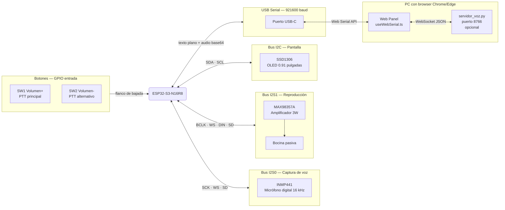

# Hardware — Kit MRD085A

> Componentes integrados del kit y cómo se conectan al ESP32-S3.
> **Los LEDs del juego son virtuales** — se muestran únicamente en el Web Panel.

---

## Componentes y conexiones

---

## Pines del kit (⚠️ todos por confirmar)

| Periférico | Señal | Pin estimado | Cómo confirmar |
|---|---|---|---|
| INMP441 mic | SCK | GPIO 12 | Ver silk screen del PCB |
| INMP441 mic | WS | GPIO 13 | Ver silk screen del PCB |
| INMP441 mic | SD (data) | GPIO 11 | Ver silk screen del PCB |
| MAX98357A amp | BCLK | GPIO 5 | Ver silk screen del PCB |
| MAX98357A amp | WS (LRCLK) | GPIO 4 | Ver silk screen del PCB |
| MAX98357A amp | DIN | GPIO 6 | Ver silk screen del PCB |
| MAX98357A amp | SD (enable) | GPIO 7 | Ver silk screen del PCB |
| OLED SSD1306 | SDA | GPIO 21 | I2C scanner sketch |
| OLED SSD1306 | SCL | GPIO 22 | I2C scanner sketch |
| SW1 Volumen+ | GPIO | GPIO 0 | Ver serigrafía del botón |
| SW2 Volumen- | GPIO | GPIO 35 | Ver serigrafía del botón |
| LEDs del juego | — | ninguno | Solo en Web Panel (virtual) |

> **Cómo leer los pines del kit**: Los pines GPIO están impresos en el PCB (el circuito verde).
> Busca números como "GPIO11", "IO11" o simplemente "11" al lado de cada componente.
> También puedes buscar en internet el nombre exacto del kit: **"MRD085A ESP32-S3 schematic"**.
