```mermaid
%%{init: {"flowchart": {"htmlLabels": false}} }%%
flowchart TD
    BOOT(["1. INICIO: ESP32-S3 encendido + browser abre panel"]) --> HW1

    subgraph HW_INIT ["HARDWARE ESP32 setup()"]
        HW1[("2. HW: Configurar GPIO 4 LEDs")] --> HW2[("3. HW: Inicializar I2S MAX98357A speaker")]
        HW2 --> IO1[/"4. Serial 115200: READY notificar al panel"/]
    end

    subgraph BR_INIT ["BROWSER inicializacion"]
        W1["5. Descargar modelo Whisper WASM 39MB si no esta en cache"] --> W2["6. Cargar modelo en Web Worker"]
        W2 --> W3[/"7. Badge Whisper listo en la UI"/]
    end

    IO1 --> IDLE
    W3 --> IDLE
    IDLE(["8. ESTADO: IDLE — ESP32 espera START"])

    subgraph BR_LOOP ["BROWSER bucle continuo de voz — activo en IDLE LISTENING PAUSA GAMEOVER"]
        BL1["9. getUserMedia microfono del sistema"] --> BL2["10. ScriptProcessorNode RMS calculado por bloque"]
        BL2 --> BL3{"11. RMS mayor 0.025 por 2 bloques consecutivos?"}
        BL3 -->|"No: silencio"| BL2
        BL3 -->|"Si: voz detectada"| BL4["12. Acumular audio Float32Array"]
        BL4 --> BL5{"13. Silencio 1.2s o timeout 12s?"}
        BL5 -->|"No: audio continua"| BL4
        BL5 -->|"Si: fin enunciado"| BL6["14. Enviar Float32Array al Web Worker"]
        BL6 --> BL7["15. Whisper WASM transcribe 1-3s"]
        BL7 --> BL8[["16. validador.ts normaliza a COMANDO"]]
    end

    BL8 --> SEND{"17. Comando valido?"}
    SEND -->|"DESCONOCIDO: ignorar"| BR_LOOP
    SEND -->|"ROJO VERDE AZUL AMARILLO START STOP etc"| SER1

    subgraph SERIAL_WRITE ["Web Serial API escritura"]
        SER1[/"18. Serial write: ROJO\n 115200 baud"/]
    end

    SER1 --> CMD1{"19. ESP32 recibe en game_engine.cpp"}
    CMD1 -->|"DESCONOCIDO o no valido en estado actual"| IDLE
    CMD1 -->|"STOP"| GAMEOVER
    CMD1 -->|"START"| R1

    subgraph REINICIO ["NUEVA PARTIDA game_engine.cpp"]
        R1["20. nivel=1 puntuacion=0 seed=millis"] --> R2["21. Generar secuencia hasta MAX_NIVEL"]
        R2 --> R3[/"22. Serial: STATE:SHOWING + SEQUENCE:colores"/]
    end

    R3 --> SQ1

    subgraph SECUENCIA ["SHOWING led_control.cpp + sound_control.cpp"]
        SQ1[("23. HW: GPIO HIGH LED encendido 800ms")] --> SQ2[("24. HW: I2S MAX98357A tono del color")]
        SQ2 --> SQ3[("25. HW: GPIO LOW LED apagado pausa 300ms")]
        SQ3 --> SQ4[/"26. Serial: LED:COLOR y LED:OFF al panel"/]
        SQ4 --> SQ5{"27. Quedan mas colores en la secuencia?"}
        SQ5 -->|"Si: siguiente color"| SQ1
        SQ5 -->|"No: secuencia terminada"| SQ6[/"28. Serial: STATE:LISTENING + EXPECTED:color"/]
    end

    SQ6 --> LISTEN
    LISTEN(["29. ESTADO: LISTENING timeout 15000ms — browser escucha voz"])
    LISTEN --> TMR

    subgraph TIMER_HW ["TIMER hardware ESP32"]
        TMR[("30. HW: Timer ESP32 contando ms")] --> TMR2{"31. elapsed mayor 15000ms?"}
        TMR2 -->|"No: seguir"| TMR
    end

    TMR2 -->|"Si: timeout"| TX1

    subgraph TOUT ["TIMEOUT Sin respuesta del jugador"]
        TX1[/"32. Serial: RESULT:TIMEOUT al panel"/] --> TX2[("33. HW: MAX98357A sonido error I2S")]
    end

    TX2 --> GAMEOVER

    CMD1 -->|"REPITE: regresa paso 23"| SQ1
    CMD1 -->|"PAUSA"| PA1

    subgraph PAUSADO ["PAUSA Timer detenido"]
        PA1[/"34. Serial: STATE:PAUSA timer detenido"/] --> PA2{"35. Se recibio START o PAUSA?"}
        PA2 -->|"No: seguir esperando"| PA2
    end

    PA2 -->|"Si: reanudar"| SQ6

    subgraph EVAL ["EVALUATING game_engine.cpp"]
        EV1[/"36. Serial: STATE:EVALUATING"/] --> EV2{"37. cmd igual al color esperado?"}
    end

    CMD1 -->|"color detectado"| EV1

    EV2 -->|"Si: correcto"| EV3{"38. Secuencia completa?"}
    EV3 -->|"No: siguiente color"| EV4[/"39. Serial: RESULT:CORRECT pos++"/]
    EV4 -->|"regresa paso 28"| SQ6

    EV3 -->|"Si: nivel superado"| LV1

    subgraph NIVEL ["LEVEL UP"]
        LV1["40. puntuacion += nivel x 10, nivel++"] --> LV2[("41. HW: MAX98357A tonos de acierto")]
        LV2 --> LV3[/"42. Serial: LEVEL:N + SCORE:P al panel"/]
    end

    LV3 -->|"nivel nuevo: regresa paso 23"| SQ1

    EV2 -->|"No: incorrecto"| WR1

    subgraph INCORRECTO ["WRONG Respuesta incorrecta"]
        WR1[/"43. Serial: RESULT:WRONG al panel"/] --> WR2[("44. HW: MAX98357A error LEDs parpadean")]
        WR2 --> WR3["45. delay 800ms"]
    end

    WR3 --> GAMEOVER

    subgraph GOVER ["GAME OVER Fin de la partida"]
        GAMEOVER[/"46. Serial: STATE:GAMEOVER"/] --> GV1[("47. HW: Todos GPIO LOW LEDs apagados")]
        GV1 --> GV2[("48. HW: MAX98357A melodia gameover")]
        GV2 --> GV3[/"49. Serial: GAMEOVER + SCORE:P al panel"/]
    end

    GV3 --> FIN{"50. Browser detecta START o REINICIAR via Whisper?"}
    FIN -->|"No: seguir escuchando en GAMEOVER"| FIN
    FIN -->|"Si: nueva partida"| R1

    classDef estado fill:#0f2d4a,stroke:#4a9eff,color:#fff
    classDef decision fill:#3d2000,stroke:#ff9900,color:#fff
    classDef proceso fill:#0a2a0a,stroke:#33cc33,color:#ddd
    classDef error fill:#2a0a0a,stroke:#ff4444,color:#fff
    classDef terminal fill:#1a0a2a,stroke:#9933ff,color:#fff
    classDef hardware fill:#1a1500,stroke:#ddaa00,color:#fff
    classDef browser fill:#002a2a,stroke:#00cccc,color:#fff

    class IDLE,LISTEN estado
    class CMD1,EV2,EV3,BL3,BL5,SQ5,TMR2,FIN,PA2,SEND decision
    class R1,R2,R3,SQ6,EV1,EV4,LV1,WR3,TX1 proceso
    class WR1,TX2,GAMEOVER,GV3 error
    class BOOT terminal
    class HW1,HW2,SQ1,SQ2,SQ3,PA1,LV2,WR2,GV1,GV2,TMR hardware
    class W1,W2,W3,BL1,BL2,BL3,BL4,BL5,BL6,BL7,BL8,SER1 browser
```

# Diagrama de flujo — Opción C: ESP32 + Whisper en browser

> Ciclo completo del juego en producción.
> El ESP32 maneja el juego, LEDs y sonidos.
> El browser maneja el reconocimiento de voz y el panel visual.
> Cada paso está numerado en orden de ejecución.

---

---

## Índice de pasos

| Paso | Descripción | Quién |
|---|---|---|
| 1 | INICIO: ESP32 encendido + browser abre panel | — |
| 2 | HW: Configurar GPIO 4 LEDs | ESP32 |
| 3 | HW: Inicializar MAX98357A | ESP32 |
| 4 | Serial: READY | ESP32 |
| 5–7 | Descargar/cargar modelo Whisper WASM | Browser |
| 8 | ESTADO: IDLE | ESP32 |
| 9–16 | Bucle continuo: mic → VAD → Whisper → validador.ts | Browser |
| 17 | Decision: Comando válido? | Browser |
| 18 | Serial write: COMANDO\n | Browser |
| 19 | Decision: Comando en game_engine | ESP32 |
| 20 | nivel=1 puntuacion=0 | ESP32 |
| 21 | Generar secuencia | ESP32 |
| 22 | Serial: STATE:SHOWING SEQUENCE | ESP32 |
| 23 | HW: LED GPIO HIGH 800ms | ESP32 |
| 24 | HW: Tono I2S MAX98357A | ESP32 |
| 25 | HW: LED GPIO LOW 300ms | ESP32 |
| 26 | Serial: LED:COLOR y LED:OFF | ESP32 |
| 27 | Decision: Más colores? | ESP32 |
| 28 | Serial: STATE:LISTENING EXPECTED | ESP32 |
| 29 | ESTADO: LISTENING — browser escucha | ESP32 + Browser |
| 30 | HW: Timer ESP32 contando | ESP32 |
| 31 | Decision: elapsed > 15000ms? | ESP32 |
| 32 | Serial: RESULT:TIMEOUT | ESP32 |
| 33 | HW: MAX98357A sonido error | ESP32 |
| 34 | Serial: STATE:PAUSA | ESP32 |
| 35 | Decision: START o PAUSA? | ESP32 |
| 36 | Serial: STATE:EVALUATING | ESP32 |
| 37 | Decision: cmd == esperado? | ESP32 |
| 38 | Decision: Secuencia completa? | ESP32 |
| 39 | Serial: RESULT:CORRECT pos++ | ESP32 |
| 40 | puntuacion += nivel x 10, nivel++ | ESP32 |
| 41 | HW: MAX98357A tonos de acierto | ESP32 |
| 42 | Serial: LEVEL + SCORE | ESP32 |
| 43 | Serial: RESULT:WRONG | ESP32 |
| 44 | HW: MAX98357A error LEDs parpadean | ESP32 |
| 45 | delay 800ms | ESP32 |
| 46 | Serial: STATE:GAMEOVER | ESP32 |
| 47 | HW: Todos GPIO LOW | ESP32 |
| 48 | HW: Melodia gameover | ESP32 |
| 49 | Serial: GAMEOVER + SCORE | ESP32 |
| 50 | Decision: START o REINICIAR? | Browser + ESP32 |
