```mermaid
%%{init: {"flowchart": {"htmlLabels": false}} }%%
flowchart TD
    BOOT(["1. INICIO: python main.py"]) --> I1

    subgraph SW_INIT ["INICIALIZACION Software"]
        I1["2. Cargar Whisper Python para fallback sin panel"] --> I2[["3. inicializar_tts pyttsx3 espanol"]]
        I2 --> I3[/"4. Servidor WebSocket puerto 8765"/]
        I3 --> I4["5. Lanzar hilo_tick thread 200ms"]
        I4 --> I5[["6. esperar_tts threading.Event"]]
        I5 --> I6[/"7. TTS: Bienvenido al Simon Dice"/]
    end

    I6 --> IDLE
    IDLE(["8. ESTADO: IDLE"])
    IDLE --> CHECK

    subgraph DECISION_VOZ ["Quien hace el reconocimiento de voz?"]
        CHECK{"9. Panel web conectado? ws.hay_clientes"}
        CHECK -->|"Si: browser hace Whisper WASM"| BROWSER
        CHECK -->|"No: Python hace Whisper local"| MIC1
    end

    subgraph BROWSER_VOZ ["BROWSER Whisper WASM bucle continuo"]
        BROWSER["10. Browser escucha mic del sistema"] --> BR2["11. VAD en JavaScript RMS mayor 0.025"]
        BR2 --> BR3["12. Whisper WASM transcribe 1-3s"]
        BR3 --> BR4[["13. validador.ts normaliza a COMANDO"]]
        BR4 --> BR5[/"14. WebSocket: tipo:comando comando:ROJO"/]
    end

    subgraph VOZ ["PIPELINE DE VOZ PYTHON hilo_voz"]
        MIC1[("15. Microfono sounddevice InputStream")] --> B1["16. Leer bloque 50ms calcular RMS"]
        B1 --> B2{"17. RMS mayor umbral VAD 0.025?"}
        B2 -->|"No: silencio"| MIC1
        B2 -->|"Si"| B3{"18. 2 bloques consecutivos histeresis?"}
        B3 -->|"No: ruido puntual"| B2
        B3 -->|"Si: voz confirmada"| B4[["19. pausar_timeout congelar timer"]]
        B4 --> B5["20. Acumular bloques de audio en buffer"]
        B5 --> B6{"21. Silencio mayor 1.2s o limite 6s?"}
        B6 -->|"No: jugador sigue hablando"| B5
        B6 -->|"Si: fin del enunciado"| B7[["22. Whisper.transcribe idioma es"]]
        B7 --> B8{"23. Alucinacion? loop o sin vocabulario"}
        B8 -->|"Si: descartar"| MIC1
        B8 -->|"No: texto valido"| B9[["24. validador.py normalizar a COMANDO"]]
        B9 --> B10[["25. reanudar_timeout descongelar"]]
    end

    BR5 --> CMD1
    B10 --> CMD1
    CMD1{"26. Que comando se recibio?"}
    CMD1 -->|"DESCONOCIDO"| IDLE
    CMD1 -->|"STOP"| GAMEOVER
    CMD1 -->|"START o EMPIEZA"| R1

    subgraph REINICIO ["_reiniciar Nueva partida"]
        R1["27. nivel=1 puntuacion=0 pos=0"] --> R2["28. Generar secuencia aleatoria"]
        R2 --> R3["29. WS: SEQUENCE + STATE:SHOWING"]
    end

    R3 --> SQ1

    subgraph SECUENCIA ["SHOWING Mostrar secuencia"]
        SQ1[/"30. TTS: Mira la secuencia"/] --> SQ2
        SQ2[("31. Terminal: LED color ANSI")] --> SQ3
        SQ3[("32. Speaker: tono del color sounddevice")] --> SQ4
        SQ4[/"33. TTS: nombre del color en voz alta"/] --> SQ5
        SQ5[("34. Terminal: LED apagado pausa 300ms")] --> SQ6
        SQ6{"35. Quedan mas colores?"}
        SQ6 -->|"Si"| SQ2
        SQ6 -->|"No"| SQ7[/"36. WS: STATE:LISTENING + EXPECTED + TTS: Tu turno"/]
    end

    SQ7 --> LISTEN
    LISTEN(["37. ESTADO: LISTENING timeout 15000ms"])
    LISTEN --> TK1

    subgraph HTICK ["hilo_tick Thread 200ms"]
        TK1{"38. elapsed mayor o igual a 15000ms?"} -->|"No: seguir"| TK1
    end

    TK1 -->|"Si: tiempo agotado"| TX1

    subgraph TOUT ["TIMEOUT Sin respuesta"]
        TX1["39. _terminando=True"] --> TX2[/"40. WS: RESULT:TIMEOUT al panel"/]
        TX2 --> TX3[("41. Speaker: sonido error")]
    end

    TX3 --> GAMEOVER

    subgraph EVAL ["EVALUATING Comparar respuesta"]
        EV1[/"42. WS: STATE:EVALUATING"/] --> EV2{"43. cmd igual al color esperado?"}
    end

    EV2 -->|"Si: correcto"| EV3{"44. Secuencia completa?"}
    EV3 -->|"No: sigue"| EV4[/"45. WS: RESULT:CORRECT pos++"/]
    EV4 -->|"siguiente color"| SQ7

    EV3 -->|"Si: nivel superado"| LV1

    subgraph NIVEL ["LEVEL UP"]
        LV1["46. puntuacion += nivel x 10, nivel++"] --> LV2[("47. Speaker: tonos de acierto")]
        LV2 --> LV3[/"48. TTS: Correcto Nivel N + WS: LEVEL SCORE"/]
    end

    LV3 -->|"nivel nuevo"| SQ1

    EV2 -->|"No: respuesta incorrecta"| WR1

    subgraph INCORRECTO ["WRONG Respuesta incorrecta"]
        WR1[/"49. WS: RESULT:WRONG al panel"/] --> WR2[("50. Speaker: sonido error")]
        WR2 --> WR3[/"51. TTS: Incorrecto"/]
        WR3 --> WR4["52. Esperar 0.8s"]
    end

    WR4 --> GAMEOVER

    subgraph GOVER ["GAME OVER Fin de la partida"]
        GAMEOVER[/"53. WS: STATE:GAMEOVER + GAMEOVER + SCORE:P"/] --> GV1[("54. Terminal: LEDs apagados")]
        GV1 --> GV2[("55. Speaker: melodia gameover")]
        GV2 --> GV3[/"56. TTS: Fin del juego"/]
    end

    GV3 --> FIN{"57. Se dijo START o REINICIAR?"}
    FIN -->|"No: esperar"| FIN
    FIN -->|"Si: nueva partida"| R1

    classDef estado fill:#0f2d4a,stroke:#4a9eff,color:#fff
    classDef decision fill:#3d2000,stroke:#ff9900,color:#fff
    classDef proceso fill:#0a2a0a,stroke:#33cc33,color:#ddd
    classDef error fill:#2a0a0a,stroke:#ff4444,color:#fff
    classDef terminal fill:#1a0a2a,stroke:#9933ff,color:#fff
    classDef hardware fill:#1a1500,stroke:#ddaa00,color:#fff
    classDef browser fill:#002a2a,stroke:#00cccc,color:#fff

    class IDLE,LISTEN estado
    class CMD1,EV2,EV3,B2,B3,B6,B8,SQ6,TK1,FIN,CHECK decision
    class I1,I2,I4,B5,R1,R2,R3,SQ1,SQ7,EV1,LV1,WR4,TX1 proceso
    class WR1,WR2,WR3,TX2,GAMEOVER,GV3 error
    class BOOT terminal
    class MIC1,SQ2,SQ3,SQ5,LV2,TX3,GV1,GV2 hardware
    class BROWSER,BR2,BR3,BR4,BR5 browser
```

# Diagrama de flujo — Simulador PC

> Ciclo completo del juego corriendo en la PC (sin hardware).
> Cada paso está numerado en orden de ejecución.
> El reconocimiento de voz lo hace el browser (Whisper WASM) cuando el panel está conectado,
> o Python (Whisper local) cuando el panel no está conectado.

---

---

## Índice de pasos

| Paso | Descripción | Tipo |
|---|---|---|
| 1 | INICIO: python main.py | Terminal |
| 2 | Cargar Whisper Python (fallback) | Software |
| 3 | inicializar_tts pyttsx3 | Software |
| 4 | Servidor WebSocket :8765 | I/O |
| 5 | Lanzar hilo_tick | Software |
| 6 | esperar_tts Event | Software |
| 7 | TTS: Bienvenida | I/O |
| 8 | ESTADO: IDLE | Estado |
| 9 | Decision: panel conectado? | Decision |
| 10–14 | Browser: VAD + Whisper WASM + validador.ts + WebSocket | Browser |
| 15 | Micrófono sounddevice | Hardware |
| 16 | Calcular RMS del bloque | Software |
| 17 | Decision: RMS mayor umbral? | Decision |
| 18 | Decision: 2 bloques consecutivos? | Decision |
| 19 | pausar_timeout | Software |
| 20 | Acumular audio | Software |
| 21 | Decision: Silencio 1.2s? | Decision |
| 22 | Whisper.transcribe | Software |
| 23 | Decision: Alucinación? | Decision |
| 24 | validador.py | Software |
| 25 | reanudar_timeout | Software |
| 26 | Decision: Qué comando? | Decision |
| 27 | nivel=1 puntuacion=0 | Software |
| 28 | Generar secuencia | Software |
| 29 | WS: SEQUENCE + STATE | I/O |
| 30 | TTS: Mira la secuencia | I/O |
| 31 | Terminal: LED ANSI | Hardware |
| 32 | Speaker: tono sounddevice | Hardware |
| 33 | TTS: nombre del color | I/O |
| 34 | Terminal: LED apagado | Hardware |
| 35 | Decision: Más colores? | Decision |
| 36 | WS: STATE:LISTENING + TTS | I/O |
| 37 | ESTADO: LISTENING | Estado |
| 38 | Decision: elapsed > 15000ms? | Decision |
| 39 | _terminando=True | Software |
| 40 | WS: RESULT:TIMEOUT | I/O |
| 41 | Speaker: sonido error | Hardware |
| 42 | WS: STATE:EVALUATING | I/O |
| 43 | Decision: cmd == esperado? | Decision |
| 44 | Decision: Secuencia completa? | Decision |
| 45 | WS: RESULT:CORRECT pos++ | I/O |
| 46 | puntuacion += nivel x 10, nivel++ | Software |
| 47 | Speaker: tonos de acierto | Hardware |
| 48 | TTS: Correcto + WS LEVEL SCORE | I/O |
| 49 | WS: RESULT:WRONG | I/O |
| 50 | Speaker: sonido error | Hardware |
| 51 | TTS: Incorrecto | I/O |
| 52 | Esperar 0.8s | Software |
| 53 | WS: STATE:GAMEOVER + SCORE | I/O |
| 54 | Terminal: LEDs apagados | Hardware |
| 55 | Speaker: melodia gameover | Hardware |
| 56 | TTS: Fin del juego | I/O |
| 57 | Decision: START o REINICIAR? | Decision |
