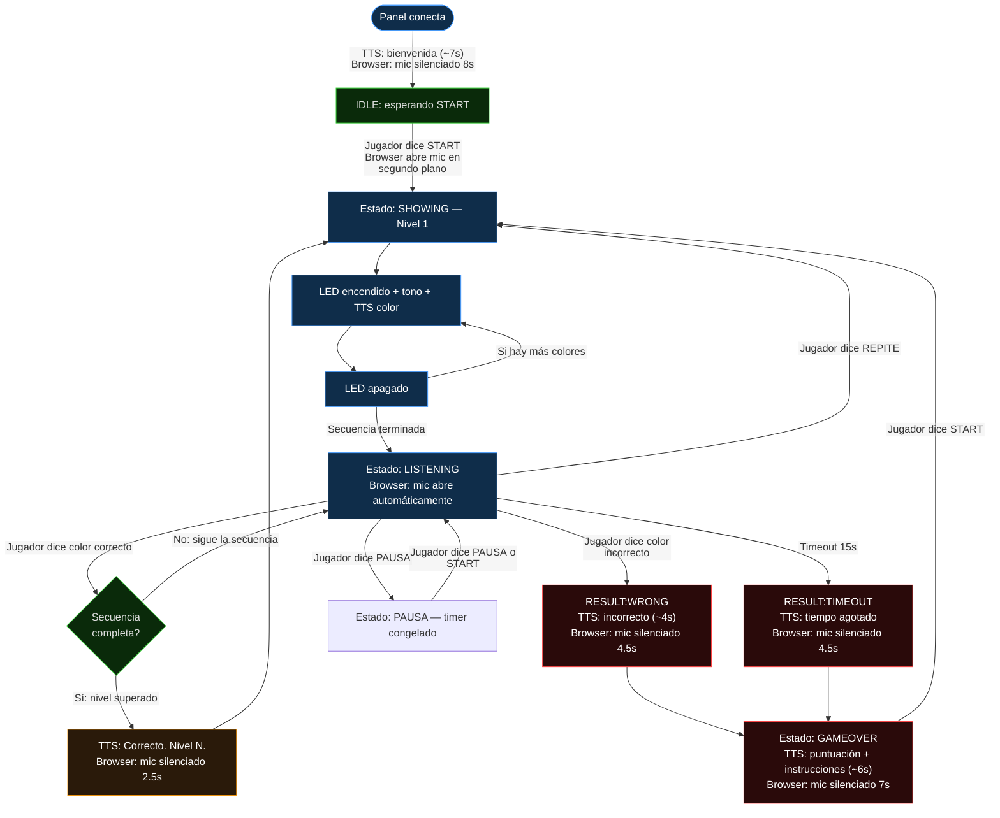

# Flujo de conversación con el sistema

> Cómo interactúa el jugador con Simon Dice por Voz en cada estado del juego.
> Arquitectura actual: Browser Whisper WASM + simulador Python WebSocket / ESP32 Web Serial.

---

## Comandos de voz disponibles

| Comando | Sinónimos reconocidos | Cuándo es válido |
|---|---|---|
| `START` | empieza, inicia, comienza, jugar, arranca, vamos | IDLE, GAMEOVER, PAUSA |
| `ROJO` | roja, roxo, ronjo, roco, roso | LISTENING |
| `VERDE` | berde, berdi, verd, erde, birde | LISTENING |
| `AZUL` | asul, azur, asor, asur, azuul | LISTENING |
| `AMARILLO` | amarilla, amarijo, marillo, amarilo, marrillo | LISTENING |
| `REPITE` | repetir, repita, repítelo, otra vez, de nuevo | LISTENING |
| `PAUSA` | pausar, espera, esperar | LISTENING, PAUSA |
| `STOP` | para, parar, termina, fin, salir, detente, alto | cualquier momento |
| `REINICIAR` | reinicia, reset, volver, reinicio | GAMEOVER |

El validador (`validador.ts` / `validador.py`) normaliza el texto de Whisper:
elimina acentos, pasa a mayúsculas, quita puntuación, busca variantes fonéticas.
Solo busca palabra por palabra si el texto tiene ≤ 3 palabras (evita falsos positivos).

---

## Orquestador de ventanas de silencio

El browser **silencia el micrófono automáticamente** después de ciertos eventos para evitar
que el TTS del simulador Python sea capturado por Whisper como comando de voz.

| Evento | Ventana de silencio | Razón |
|---|---|---|
| Cliente conecta | 8 segundos | TTS narra bienvenida y reglas |
| `RESULT:CORRECT` | 2.5 segundos | TTS dice "Correcto. Nivel N." |
| `RESULT:WRONG` | 4.5 segundos | TTS dice "Incorrecto. Di empieza..." |
| `RESULT:TIMEOUT` | 4.5 segundos | TTS dice "Tiempo agotado. Di empieza..." |
| `GAMEOVER` | 7 segundos | TTS narra puntuación y cómo reiniciar |
| `STATE:LISTENING` | 0 (limpia) | Escuchar de inmediato cuando es el turno |

Cuando el estado cambia a `SHOWING`, el browser cancela cualquier grabación activa
y limpia los datos del turno anterior (última detección, texto crudo, último resultado).

---

## Diagrama de conversación — ciclo de una partida



---

## Transcripción de una sesión típica (modo simulador WebSocket)

```
[SISTEMA] Whisper WASM cargado en browser — badge "Whisper listo"
[SISTEMA] Estado: IDLE

=== CONEXIÓN ===
[BROWSER] WebSocket conectado → mic SILENCIADO 8s
[SIMULADOR] TTS: "Panel conectado."
[SIMULADOR] TTS: "Bienvenido a Simon Dice por Voz."
[SIMULADOR] TTS: "El sistema mostrará una secuencia de colores."
[SIMULADOR] TTS: "Cuando sea tu turno, di el color en voz alta."
[SIMULADOR] TTS: "Di empieza para comenzar."
[BROWSER] (8s transcurridos) → mic activo para IDLE

=== INICIO DE PARTIDA ===
[JUGADOR] "empieza"
[BROWSER] VAD detecta voz → mic graba → Whisper: "empieza" → START
[BROWSER] Envía {"tipo":"comando","comando":"START"} por WebSocket
[SIMULADOR] TTS: "Mira y escucha."
[SISTEMA] Estado: SHOWING — Nivel 1

[SISTEMA] LED ROJO encendido | Tono 262Hz
[SIMULADOR] TTS: "rojo"
[SISTEMA] LED ROJO apagado
[BROWSER] mic CANCELADO durante SHOWING

[SISTEMA] Estado: LISTENING — timeout 15s
[BROWSER] mic ACTIVO (ventana de silencio = 0)

=== TURNO CORRECTO ===
[JUGADOR] "rojo"
[BROWSER] VAD → Whisper: "rojo" → ROJO
[BROWSER] Envía {"tipo":"comando","comando":"ROJO"} → CORRECT
[SIMULADOR] TTS: "Correcto. Nivel 2."
[BROWSER] mic SILENCIADO 2.5s

=== TURNO INCORRECTO ===
[JUGADOR] "azul"  ← respuesta incorrecta
[SISTEMA] RESULT:WRONG
[SIMULADOR] TTS: "Incorrecto. Di empieza para intentar de nuevo."
[BROWSER] mic SILENCIADO 4.5s → Estado: GAMEOVER

=== GAME OVER ===
[SIMULADOR] TTS: "Fin del juego. Obtuviste 30 puntos."
[SIMULADOR] TTS: "Di empieza para volver a jugar."
[BROWSER] mic SILENCIADO 7s → luego activo para GAMEOVER

[JUGADOR] "empieza"
[BROWSER] Whisper: "empieza" → START → nueva partida
```

---

## Sesión con PAUSA

```
[SISTEMA] Estado: LISTENING — esperando "VERDE"

[JUGADOR] "pausa"
[BROWSER] Whisper → PAUSA → enviado
[SISTEMA] Estado: PAUSA — timer congelado

[JUGADOR] "pausa"   (o "empieza")
[SISTEMA] Estado: LISTENING — timer reanuda
```

---

## Filtro de alucinaciones de Whisper

Whisper a veces inventa texto cuando no hay voz real. El sistema lo filtra así:

1. **Verificación de energía en el worker**: Si el RMS máximo del audio < 0.012, no se llama a Whisper. Devuelve `""` de inmediato.
2. **Sin vocabulario del juego**: Si el texto transcrito no contiene ninguna palabra del vocabulario del juego, se descarta como alucinación.
3. **Repetición excesiva**: Si la misma palabra aparece > 3 veces, es un loop de alucinación.
4. **Texto muy largo**: Solo se busca palabra por palabra si el texto tiene ≤ 3 palabras (evita falsos positivos como "no hay nada que no hay" → NO).
5. **Ventana de silencio**: El mic no abre durante los primeros segundos después de eventos con TTS, evitando que Whisper capture el audio del narrador.

---

## Mensajes WebSocket durante una partida (modo simulador)

| Evento | Mensaje JSON | Cuándo |
|---|---|---|
| Sistema listo | `{"tipo":"ready"}` | Al arrancar el simulador |
| Cambio de estado | `{"tipo":"state","estado":"SHOWING"}` | Cada transición |
| LED encendido | `{"tipo":"led","color":"ROJO"}` | Durante secuencia |
| LED apagado | `{"tipo":"led","color":null}` | Durante secuencia |
| Secuencia completa | `{"tipo":"sequence","secuencia":["ROJO","VERDE"]}` | Al iniciar nivel |
| Color esperado | `{"tipo":"expected","esperado":"ROJO"}` | Al iniciar turno |
| Resultado | `{"tipo":"result","resultado":"CORRECT"}` | Tras evaluar |
| Nivel | `{"tipo":"level","nivel":3}` | Al subir nivel |
| Puntuación | `{"tipo":"score","puntuacion":30}` | Al cambiar score |
| Game Over | `{"tipo":"gameover"}` | Fin de partida |
| Log | `{"tipo":"log","raw":"mensaje"}` | Debug/info |

### Panel → simulador

```json
{"tipo": "comando", "comando": "ROJO"}
```

---

## Bugs resueltos

| Bug | Causa | Estado |
|---|---|---|
| TTS no decía los colores | `sounddevice` y `pyttsx3` abrían el dispositivo de audio simultáneamente en Windows | **Corregido:** tono primero (bloqueante) luego TTS |
| LEDs no se veían en el panel | `_on_led_encender`/`_on_led_apagar` no enviaban WS; `page.tsx` usaba `estadoJuego.esperado` en lugar de `ledActivo` | **Corregido:** mensaje `tipo:"led"` + campo `ledActivo` |
| Whisper capturaba TTS del simulador | El mic estaba abierto mientras el narrador Python hablaba | **Corregido:** ventanas de silencio de 2.5–8s según el evento |
| "[MÚSICA]" y alucinaciones en IDLE | Whisper procesaba silencio/ruido de fondo repetidamente | **Corregido:** ventana de silencio + filtro de energía RMS + solo loguear en LISTENING |
| "empieza" no reconocido | Whisper tiny con poco contexto reconocía "Empiezan.", "En pieza." | **Corregido:** modelo whisper-small q8 + initial_prompt expandido |
| Log spameado con DESCONOCIDO | El bucle de fondo logueaba cada intento en IDLE/GAMEOVER | **Corregido:** solo loguear resultados de voz en estado LISTENING |
| Badge "Habla ahora" antes de abrir mic | `transcribiendo=true` se activaba antes de `getUserMedia` | **Corregido:** estado `micAbierto` separado |
| Badge mostraba en GAMEOVER/IDLE | Bucle de fondo activaba el badge visual en todos los estados | **Corregido:** badge y nivel de mic solo visibles en estado LISTENING |
