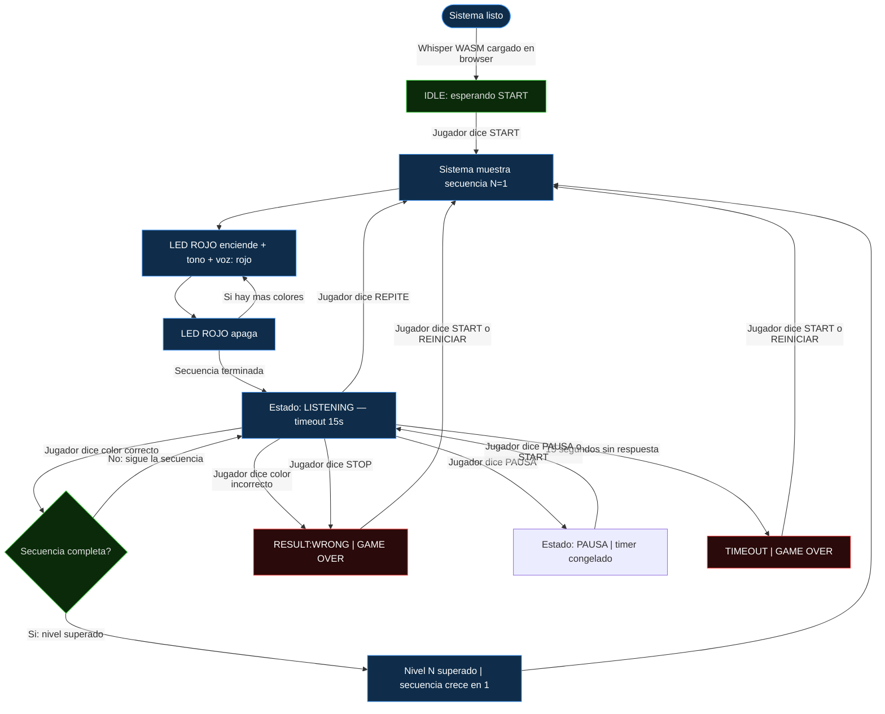

# Flujo de conversación con el sistema

> Cómo interactúa el jugador con Simon Dice por Voz en cada estado del juego.

---

## Comandos de voz disponibles

| Comando | Sinónimos reconocidos | Cuándo es válido |
|---|---|---|
| `START` | empieza, inicia, comienza, jugar, arranca | IDLE, GAMEOVER, PAUSA |
| `ROJO` | roja, roxo, ronjo, roco | LISTENING |
| `VERDE` | berde, berdi, verd | LISTENING |
| `AZUL` | asul, azur, asor | LISTENING |
| `AMARILLO` | amarilla, amarijo, marillo, amarilo | LISTENING |
| `REPITE` | repetir, repita, otra vez, de nuevo | LISTENING |
| `PAUSA` | pausar, espera | LISTENING |
| `STOP` | para, parar, termina, fin, salir | cualquier momento |
| `REINICIAR` | reinicia, reset, volver | GAMEOVER |

El validador (`validador.ts` / `validador.py`) normaliza el texto de Whisper:
elimina acentos, pasa a mayúsculas, quita puntuación, busca variantes fonéticas.

---

## Diagrama de conversación — ciclo de una partida



---

## Transcripción de una sesión típica (con panel conectado)

```
[SISTEMA] Whisper WASM cargado en browser — badge "Whisper listo"
[SISTEMA] Estado: IDLE

[JUGADOR] "empieza"
[BROWSER] Whisper reconoce: "empieza" → START
[BROWSER] Envía "START" por WebSocket / Serial al simulador/ESP32
[SISTEMA] Estado: SHOWING — Nivel 1

[SISTEMA] LED ROJO encendido
[SISTEMA] Tono 262 Hz (400ms)
[SIMULADOR] TTS: "rojo"  ← solo en modo simulador PC
[SISTEMA] LED ROJO apagado
[SISTEMA] Estado: LISTENING — timeout 15s

[JUGADOR] "rojo"
[BROWSER] Whisper reconoce: "rojo" → ROJO
[BROWSER] Envía "ROJO" por WebSocket / Serial
[SISTEMA] Estado: EVALUATING
[SISTEMA] CORRECTO — secuencia completa (1/1)
[SISTEMA] TTS: "Correcto. Nivel 2."  ← solo simulador
[SISTEMA] Estado: SHOWING — Nivel 2

[SISTEMA] LED VERDE encendido → tono → TTS "verde" → apagado
[SISTEMA] LED ROJO encendido → tono → TTS "rojo" → apagado
[SISTEMA] Estado: LISTENING

[JUGADOR] "verde"
[SISTEMA] CORRECTO — 1/2

[JUGADOR] "rojo"
[SISTEMA] CORRECTO — 2/2 → nivel superado

... (ciclo continua hasta GAME OVER)

[JUGADOR] "azul"   ← respuesta incorrecta
[SISTEMA] TTS: "Incorrecto."  ← solo simulador
[SISTEMA] Sonido de error
[SISTEMA] Estado: GAME OVER — puntuación: 30

[JUGADOR] "reinicia"
[BROWSER] Whisper reconoce: "reinicia" → REINICIAR
[SISTEMA] Estado: SHOWING — Nivel 1 (nueva partida)
```

---

## Sesión con PAUSA

```
[SISTEMA] Estado: LISTENING — esperando "VERDE"

[JUGADOR] "pausa"
[BROWSER] Whisper → PAUSA → enviado
[SISTEMA] Estado: PAUSA — timer congelado

... (jugador se ausenta) ...

[JUGADOR] "pausa"   (o "empieza")
[SISTEMA] Estado: LISTENING — timer reanuda desde donde se quedó
```

---

## Sesión con REPITE

```
[SISTEMA] Estado: LISTENING — Nivel 4

[JUGADOR] "repite"
[BROWSER] Whisper → REPITE → enviado
[SISTEMA] Estado: SHOWING — secuencia del nivel 4 se muestra nuevamente
[SISTEMA] (Los 4 colores se muestran con LED + tono)
[SISTEMA] Estado: LISTENING — timeout reinicia
```

---

## Comportamiento ante comandos no reconocidos

```
[JUGADOR] "hola"
[BROWSER] Whisper transcribe: "hola"
[BROWSER] validador.ts: "hola" → DESCONOCIDO
[BROWSER] No se envía al juego — el sistema ignora
[SISTEMA] El timer continúa corriendo

[JUGADOR] (habla muy quedito o hace ruido)
[BROWSER] VAD (RMS < 0.025) no confirma voz
[BROWSER] No se envía a Whisper, el timer continúa

[JUGADOR] (silencio por 15 segundos)
[SISTEMA] TIMEOUT → GAME OVER
```

---

## Mensajes WebSocket enviados durante una partida (modo simulador)

| Evento | Mensaje JSON | Cuándo |
|---|---|---|
| Sistema listo | `{"tipo":"ready"}` | Al arrancar el simulador |
| Cambio de estado | `{"tipo":"state","estado":"SHOWING"}` | Cada transición |
| LED encendido | `{"tipo":"led","color":"ROJO"}` | Durante secuencia |
| LED apagado | `{"tipo":"led","color":null}` | Durante secuencia |
| Secuencia completa | `{"tipo":"sequence","secuencia":["ROJO","VERDE"]}` | Al iniciar nivel |
| Color esperado | `{"tipo":"expected","esperado":"ROJO"}` | Al iniciar turno |
| Palabra detectada | `{"tipo":"detected","palabra":"ROJO"}` | Tras reconocimiento |
| Texto crudo | `{"tipo":"voz","texto":"rojo","comando":"ROJO"}` | Tras Whisper Python |
| Resultado | `{"tipo":"result","resultado":"CORRECT"}` | Tras evaluar |
| Nivel | `{"tipo":"level","nivel":3}` | Al subir nivel |
| Puntuación | `{"tipo":"score","puntuacion":30}` | Al cambiar score |
| Game Over | `{"tipo":"gameover"}` | Fin de partida |
| Log | `{"tipo":"log","raw":"mensaje"}` | Debug/info |

### Panel → simulador (comando de voz reconocido por Whisper WASM en el browser)

```json
{"tipo": "comando", "comando": "ROJO"}
```

---

## Bugs resueltos

| Bug | Causa | Estado |
|---|---|---|
| TTS no decía los colores | `sounddevice` y `pyttsx3` abrían el dispositivo de audio simultáneamente en Windows | **Corregido:** el tono se reproduce primero (bloqueante) y luego TTS habla |
| LEDs no se veían en el panel durante la secuencia | `_on_led_encender`/`_on_led_apagar` no enviaban mensajes WebSocket; `page.tsx` usaba `estadoJuego.esperado` (null durante SHOWING) en lugar de un campo dedicado | **Corregido:** mensaje `tipo:"led"` + campo `ledActivo` en el estado del cliente |
| "empieza" no funcionaba con panel conectado | El browser solo activaba Whisper en STATE:LISTENING, pero "empieza" se dice en IDLE | **Corregido:** bucle continuo de voz que escucha en todos los estados: IDLE, LISTENING, PAUSA, GAMEOVER |
| Python grababa audio mientras el panel se conectaba | `hilo_voz` solo chequeaba `ws.hay_clientes` al inicio del while, no cancelaba una grabación en curso | **Corregido:** parámetro `abortar=lambda: ws.hay_clientes` en `escuchar_voz()` |
| `servidor_pc/validador.py` eliminado rompía el simulador | El simulador importaba del validador eliminado; sin él, "empieza" se convertía en "EMPIEZA" (inválido) en vez de "START" | **Corregido:** `tests/simulador_pc/validador.py` recreado con toda la lógica de normalización |
